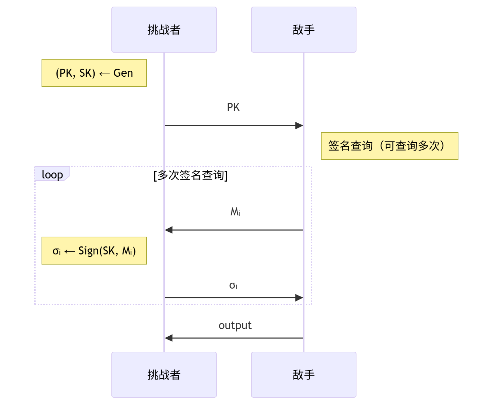
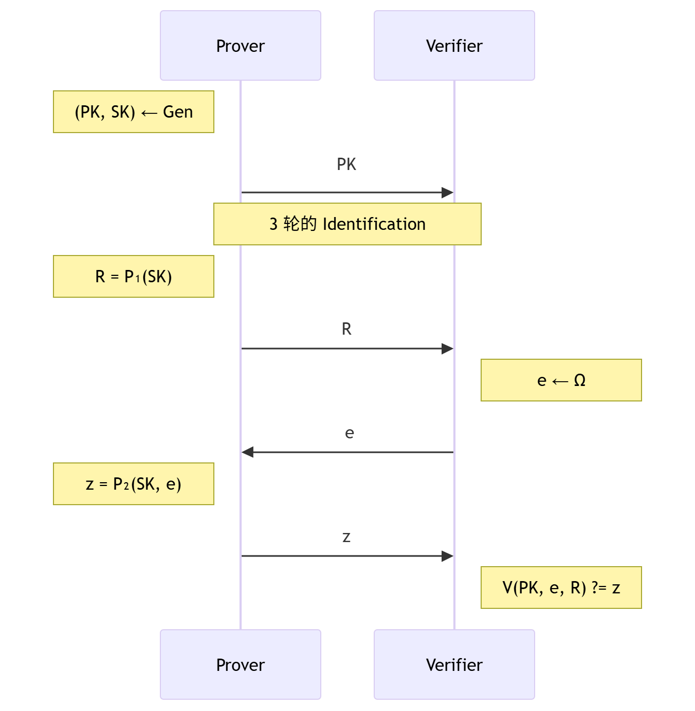
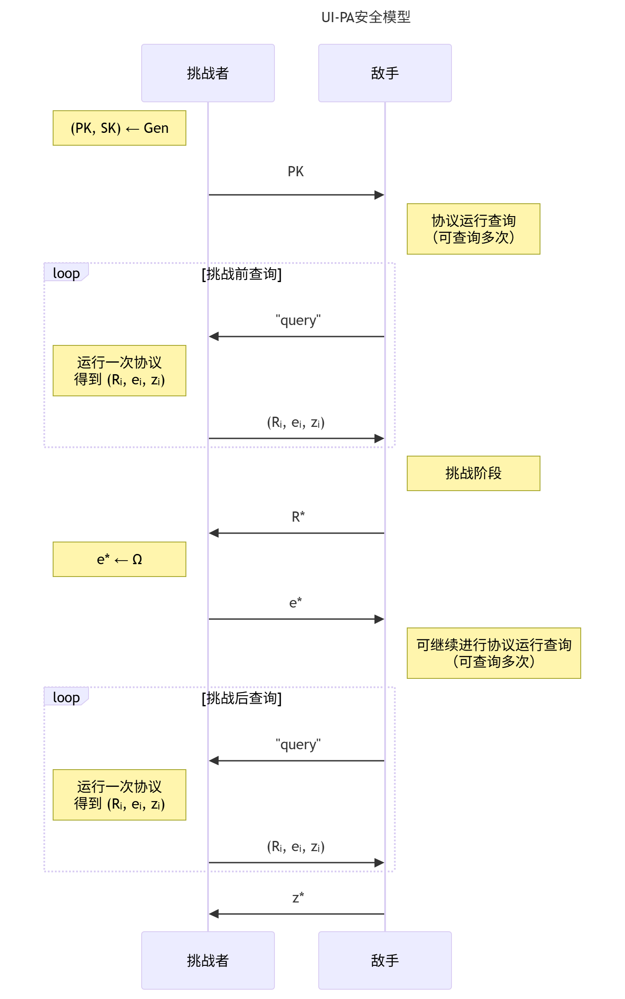
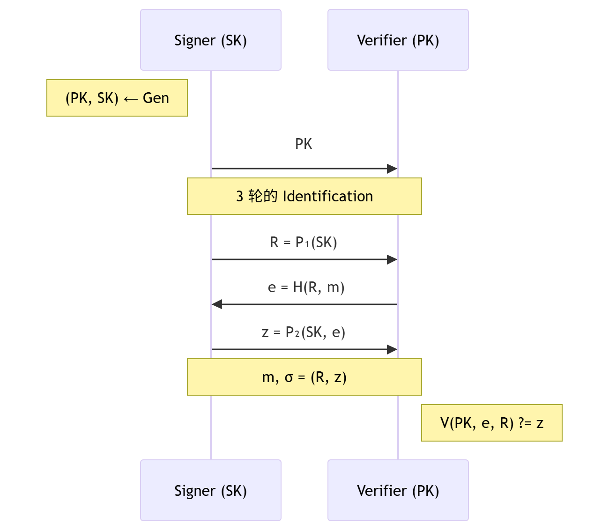
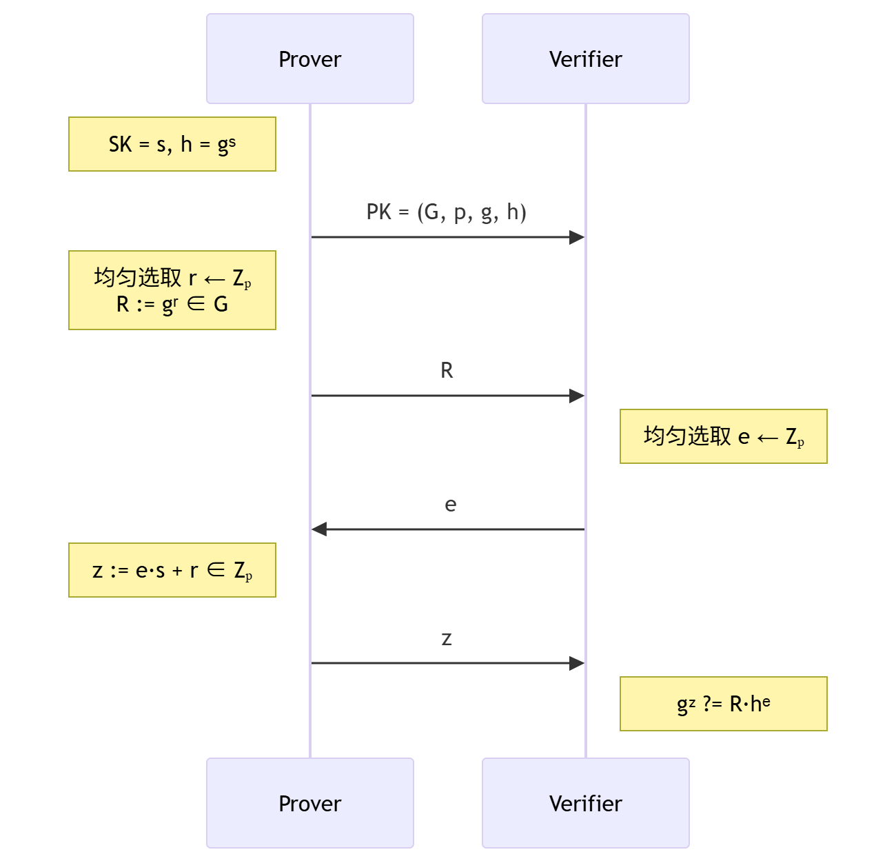
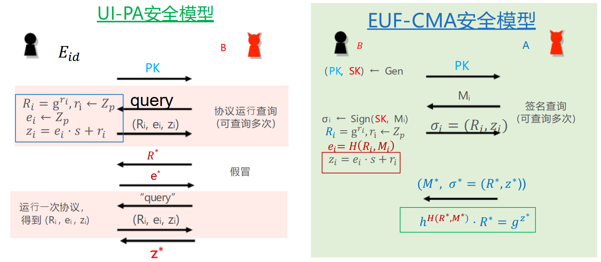
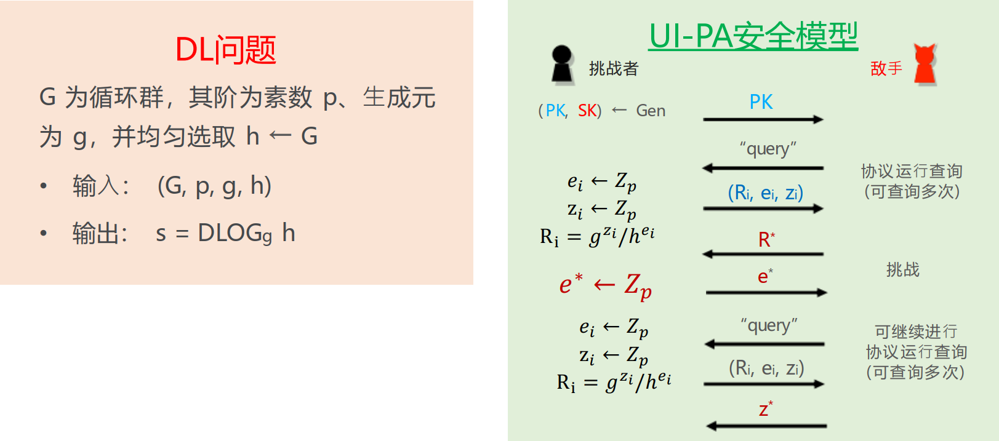
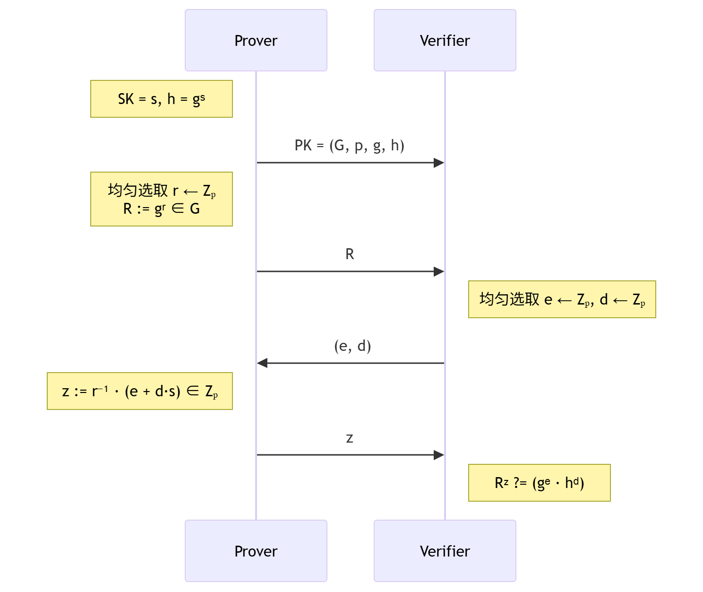

## 数字签名算法的安全性定义以及 Schnorr 签名算法
### 数字签名算法的安全性
#### 数字签名简介
- **数字签名的要求**：
    - **可认证性**：能够验证消息源，以及消息的真实性/完整性
    - **不可否认性**：签名能够被公开验证
- **数字签名实现安全认证的条件**：
    - 生成签名相对容易
    - 识别和验证签名相对容易
    - 在计算上不可伪造：
        - 对新消息伪造签名不可行
        - 对已有签名伪造新签名并通过认证不可行

#### 数字签名算法的语义及正确性要求
- **语义**：一个数字签名方案 $\mathrm{DS}$ 包含三个概率多项式时间（PPT）算法 $(\mathrm{Gen}, \mathrm{Sign}, \mathrm{Verify})$：
    1. **密钥生成算法**：$(PK, SK) \leftarrow \mathrm{Gen}(1^\lambda)$：⼀般为概率性算法
    2. **签名算法**：$\sigma \leftarrow \mathrm{Sign}(SK, M)$：$M \in \mathbb{M}$，其中 $\mathbb{M}$ 是消息空间
    3. **验证算法**：$0/1 \leftarrow \mathrm{Verify}(PK, M, \sigma)$：一般为确定性算法；输出 $1$ 表示验证通过
- **正确性要求**（Correctness）：对任意 $(PK, SK) \leftarrow \mathrm{Gen}(1^\lambda)$、任意 $M \in \mathbb{M}$、任意 $\sigma \leftarrow \mathrm{Sign}(SK, M)$，均有
    $$
    \mathrm{Verify}(PK, M, \sigma) = 1
    $$

#### 数字签名算法的 EUF-CMA 安全性
- **选择消息攻击**（Chosen Message Attacks, CMA）安全模型：
    
- **CMA 敌手攻击能力**：
    - 输入：公开信道中的 $PK, M, \sigma$
    - 运行时间：概率多项式时间 PPT
    - 攻击方式：选择消息攻击 CMA ── 敌手可以提供/决定/影响签名使用的消息
- **EUF 安全目标**：**存在不可伪造性**（Existential Unforgeability, EUF）── 敌手无法为一个**未查询过的新消息** $M^*$ 伪造有效签名 $\sigma^*$（即如果 $\mathrm{output} = (M^*, \sigma^*)$，满足 $M^* \notin \{M_i\}$ 和 $\mathrm{Verify}(PK, M^*, \sigma^*) = 1$，则攻破该目标）
- **数字签名算法的 EUF-CMA 安全性定义**: 任意概率多项式时间敌手在 CMA 安全模型中攻破 EUF 安全目标的**优势**是可忽略的，即
    $$
    \mathrm{Adv}_{\mathrm{EUF-CMA}} = \Pr\left[
    \mathrm{output} = (M^*, \sigma^*) \left|
    \begin{array}{l}
    (1)\ M^* \notin \{ M_i \} \\
    (2)\ \mathrm{Verify}(\mathrm{PK}, M^*, \sigma^*) = 1
    \end{array}
    \right.\right] = \mathrm{negl}(\lambda)
    $$

#### 数字签名算法的 sEUF-CMA 安全性
- **sEUF 安全目标**：**强存在不可伪造性**（Strong Existential Unforgeability, sEUF）── 敌手不仅无法为一个**未查询过的新消息** $M^*$ 伪造有效签名 $\sigma^*$，也无法为一个已签名消息 $M_i$ 伪造**新的有效签名** $\sigma^* \neq \sigma_i$（即如果 $\mathrm{output} = (M^*, \sigma^*)$，满足 $(M^*, \sigma^*) \notin \{(M_i, \sigma_i)\}$ 和 $\mathrm{Verify}(PK, M^*, \sigma^*) = 1$，则攻破该目标）
- **数字签名算法的 sEUF-CMA 安全性定义**: 任意概率多项式时间敌手在 CMA 安全模型中攻破 sEUF 安全目标的**优势**是可忽略的，即
    $$
    \mathrm{Adv}_{\mathrm{sEUF-CMA}} = \Pr\left[
    \mathrm{output} = (M^*, \sigma^*) \left|
    \begin{array}{l}
    (1)\ (M^*, \sigma^*) \notin \{ (M_i, \sigma_i) \} \\
    (2)\ \mathrm{Verify}(\mathrm{PK}, M^*, \sigma^*) = 1
    \end{array}
    \right.\right] = \mathrm{negl}(\lambda)
    $$

#### EUF-CMA 与 sEUF-CMA 安全性之间的关系
- **一般情况**：sEUF-CMA 安全 $\impliedby$ EUF-CMA 安全
    $$
    \mathrm{Adv}_{\mathrm{sEUF-CMA}} \leq \mathrm{Adv}_{\mathrm{EUF-CMA}}
    $$
- **若满足唯一性要求**：sEUF-CMA 安全 $\iff$ EUF-CMA 安全
    $$
    \mathrm{Adv}_{\mathrm{sEUF-CMA}} = \mathrm{Adv}_{\mathrm{EUF-CMA}}
    $$
    - **唯一性要求**（uniqueness）：$\forall (PK,SK) \leftarrow \mathrm{Gen}(1^\lambda), \forall M \in \mathbb{M}$，存在唯一的 $\sigma$ 使得 $\mathrm{Verify}(PK, M, \sigma) = 1$。

### 身份证明协议的安全性
#### 身份证明协议简介
- 核心：证明者向验证者证明自己拥有公钥 $PK$ 所对应的私钥 $SK$
- 交互流程（3 轮的 Identification）：
    

#### 身份证明协议的 UI-PA 安全性
- **被动攻击**（Passive Attacks, PA）安全模型：
    
- **PA 敌手攻击能力**：
    - 输入：公开信道中的 $PK$ 及多次运行协议生成的 $(R_i, e_i, z_i)$
    - 运行时间：概率多项式时间 PPT
- **UI 安全目标**：**不可假冒性**（Unimpersonation, UI）── 敌手无法冒充 Prover 通过协议的验证算法（即如果 $\mathrm{output} = (R^*, e^*, z^*)$ 满足 $V(PK, e^*, R^*) = z^*$，则攻破该目标）
- **身份证明协议的 UI-PA 安全性定义**：任意概率多项式时间敌手在 P A安全模型中攻破 UI 安全目标的**优势**是可忽略的，即
    $$
    \mathrm{Adv}_{\mathrm{UI-PA}} = \Pr\left(
    \mathrm{output} = z^* \left|
    V(PK, e^*, R^*) = z^*
    \right.\right) = \mathrm{negl}(\lambda)
    $$

### Fiat-Shamir 变换
- 核心：为了使用身份证明协议进行签名，证明者（签名者）可将挑战 $e$ 用哈希函数 $H(~)$ 计算，自己独立地执行协议，无需与验证者交互。
- 交互流程：
    
- Fiat-Shamir 变换的安全性：**身份证明协议是 UI-PA 安全的** + **$H$ 为 RO** $\implies$ **通过 Fiat-Shamir 变换得到的签名算法是 EUF-CMA 安全的**
    - 证明：参考后续 [Schnorr 签名算法的安全性证明](#schnorr-签名算法的-euf-cma-安全性)

### Random Oracle 模型（随机预言机）
- Random Oracle 模型（随机预言机）是对哈希函数 $H: G \to \{0,1\}^{m}$ 的假设，用于安全性证明中。
- **核心假设**：
    1. **Oracle-预言机假设**：敌手无法自己计算 $H$ 的值，只能通过查询“预言机” $H(·)$ 的方式获得 $H$ 的值：每一次查询，敌手向预言机 $H(·)$ 提交一个 $X$，$H(·)$ 返回输出 $H(X)$。
    2. **Random-随机性假设**：随机预言机 $H(·)$ 在每一个 $X$ 上的输出值 $H(X)$ 都是服从值域 $\{0,1\}^m$ 上均匀分布的，其随机性来源于预言机 $H(·)$ 内部。
    3. **Programmable-可编程性假设**：在安全性证明中，“随机预言机” $H(·)$ 由环境/挑战者向敌手提供。
- **推论**：
    1. Oracle 假设 + Random 假设：如果敌手没有向预言机 $H(·)$ 查询过某个输入 $X$，那么 $H(X)$ 的值对于敌手而言是完全均匀的。
    2. Oracle 假设 + Programmable 假设：环境/挑战者知道敌手向预言机 $H(·)$ 查询过哪些输入 $X$。
    3. Random 假设 + Programmable 假设：环境/挑战者针对敌手的每一次预言机 $H(·)$ 查询 $X$，返回值域 $\{0,1\}^m$ 上均匀分布的值作为 $H(X)$ 的值。
- **说明**:
    - RO 模型刻画了敌手只能**黑盒**的调用 Hash Function，敌手无法仅阅读 Hash Function 的代码而不调用 Hash Function 推断出 $H(X)$ 的值。

### Schnorr 身份证明协议与签名算法
#### Schnorr 身份证明协议
- 目的：Prover 向 Verifier 证明自己拥有 $PK$ 所对应的私钥 $SK$。
- 交互流程：基于椭圆曲线上的离散对数问题
    

#### Schnorr 签名算法
- **组件**：Hash Function $H: \{0,1\}^{*} \to \mathbb{Z}_p$
- **密钥生成算法** $(PK, SK) \leftarrow \mathrm{Gen}(1^\lambda)$：
    1. 选择循环群 $G$，其阶为素数 $p$、生成元为 $g$
    2. 均匀选取 $s \leftarrow \mathbb{Z}_p$，计算 $h := g^s \in G$
    3. 输出 $PK = (G, p, g, h)$，$SK = s$
- **签名算法** $\sigma \leftarrow \mathrm{Sign}(SK, M)$，消息空间为 $\mathbb{M}=\{0,1\}^{*}$
    1. 均匀选取 $r \leftarrow \mathbb{Z}_{p}$，计算 $R:=g^{r} \in G$
    2. 计算 $e:=H(R, M) \in \mathbb{Z}_{p}$
    3. 计算 $z:=e \cdot s+r \in \mathbb{Z}_{p}$
    4. 输出 $\sigma:=(R, z)$
- **验证算法** $0/1 \leftarrow \mathrm{Verify}(PK, M, \sigma=(R, z))$
    1. 计算 $e:=H(R, M) \in \mathbb{Z}_{p}$
    2. 验证 $g^{z} \stackrel{?}{=} h^{e} \cdot R$，相等输出 $1$，否则输出 $0$

#### 安全性分析
##### Schnorr 签名算法的 EUF-CMA 安全性
- **断言1**：如果在数字签名的 EUF-CMA 安全模型下，存在攻击者 $\mathcal{A}$ 以不可忽略的概率攻破 Schnorr 签名。设 $\mathcal{A}$ 的输出为 $(M^{*}, \sigma^{*}=(R^{*}, z^{*}))$，即
    $$
    Adv_{\mathcal{A}}=Pr\left(output _{\mathcal{A}}=(M^{*}, \sigma^{*})\left| h^{H(R^{*}, M^{*})} \cdot R^{*}=g^{z^{*}}\right.\right)=\text{non-negl}(\lambda)
    $$

    则 $\mathcal{A}$ 以不可忽略的概率查询过 $(R^{*}, M^{*})$ 的 Hash 值。

!!! fold info @Pf
    - **证明**：反证法，假设 $\mathcal{A}$ 没有查询过 $(R^{*}, M^{*})$ 的 Hash 值，则在 $H$ 为 RO 假设下，$H(R^{*}, M^{*})$ 对 $\mathcal{A}$ 是 $\mathbb{Z}_{p}$ 中均匀随机的元素，因此 $h^{H(R^{*}, M^{*})}$ 对 $\mathcal{A}$ 是 $G$ 中均匀随机的元素。则 $\mathcal{A}$ 猜对 $z^{*} \in \mathbb{Z}_{p}$ 满足
        $$
        h^{H(R^{*}, M^{*})}=g^{z^{*}} \cdot (R^{*})^{-1}
        $$

        的概率为 $\frac{1}{|G|}=\frac{1}{p}=negl(\lambda)$，与假设矛盾。
- **引理1（Fiat-Shamir 转换）**：**Schnorr 身份证明协议是 UI-PA 安全的** + **$H$ 为 RO** $\implies$ **Schnorr 签名算法是 EUF-CMA 安全的**
    - **思路**：将 $\mathcal{A}$ 作为 $\mathcal{B}$ 的子算法，为 $\mathcal{A}$ 提供合法的输入，以及返回合法的签名查询。利用 $\mathcal{A}$ 的输出结果帮助 $\mathcal{B}$ 在 UI-PA 中的输出正确的结果。

!!! fold info @Pf
    - **证明**：使用反证法（安全性规约）
        
        - **假设结论错误**：Schnorr 签名算法不是 EUF-CMA 安全的，即存在 PPT 敌手 $\mathcal{A}$ 以不可忽略的概率攻破 Schnorr 签名算法的 EUF-CMA 安全性。
            - 即 $\mathcal{A}$ 通过若干次签名查询后，可以输出一个未查询过的消息 $M^{*}$ 以及一个有效签名 $\sigma^{*}=(R^{*}, z^{*})$，以不可忽略的概率满足 $h^{H(R^{*}, M^{*})} \cdot R^{*}=g^{z^{*}}$
        - **证明前提错误**：构造一个 PPT 敌手 $\mathcal{B}$，在 UI-PA 安全模型下攻破 Schnorr 身份证明协议。
            - **$\mathcal{B}$ 的策略**：
                - $\mathcal{B}$ 将公钥 $PK$ 作为输入提供给 $\mathcal{A}$；设 $\mathcal{A}$ 进行的哈希查询次数为 $Q(\lambda)$，则 $\mathcal{B}$ 随机选择 $j \in [1, Q(\lambda)]$ 赌 $\mathcal{A}$ 最终输出的消息 $M^{*}=M_j$
                - 当 $\mathcal{A}$ 使用 $M_i$ 进行第 $i$ 次**签名查询**时：$\mathcal{B}$ 由于本身不具备私钥 $SK$，无法生成合法的签名，因此向挑战者 $E_{id}$ 发起查询，拿到一组合法记录 $(R_i, e_i, z_i)$，并将 $\sigma_i=(R_i, z_i)$ 返回给 $\mathcal{A}$，并自身记录 $H(R_i, M_i) = e_i$
                    - 此时若 $\mathcal{A}$ 要对签名查询进行验证，计算时需要 $H(R_i, M_i)$，只能向 $\mathcal{B}$ 查询哈希结果，必然能通过检验
                - 当 $\mathcal{A}$ 使用 $(R_k, M_k)$ 进行第 $k$ 次**哈希查询**时：
                    - 若 $k=j$ 且 $M_j \notin \{M_i\}$，即 $\mathcal{A}$ 的第 $j$ 次哈希查询的消息 $M_j$ 没有在之前的签名查询中出现过，则 $\mathcal{B}$ 向 $E_{id}$ 输入 $R_j$ 并把返回的 $e_j$ 当作自己的哈希输出，并记录 $H(R_j, M_j) = e_j$
                    - 若 $k=j$ 且 $M_j \in \{M_i\}$，则重新选择 $j \in [1, Q(\lambda)]$，直到满足 $M_j \notin \{M_i\}$
                    - 若 $k \in [1, Q(\lambda)] \setminus \{j\}$，$\mathcal{B}$ 查询是否有 $H(R_k, M_k)$ 的记录：
                        - 若有则直接返回
                        - 若没有则随机选择 $e \leftarrow \mathbb{Z}_p$ 返回并记录 $H(R_k, M_k) = e$
                - 最终当 $\mathcal{A}$ 输出 $(M^{*}, \sigma^{*}=(R^{*}, z^{*}))$ 时，若 $M^{*}=M_j$，则 $\mathcal{B}$ 输出 $z^{*}$ 作为自己的输出，否则视为失败。
            - **$\mathcal{B}$ 的优势**：
                $$
                \begin{aligned}
                Adv_{\mathcal{B}} &\geq \Pr\left[
                \begin{array}{l}
                (1)\ \mathcal{A} \text{ 成功攻破 Schnorr 签名算法的 EUF-CMA 安全性} \\
                (2)\ \mathcal{A} \text{ 查询过 } (R^{*}, M^{*}) \text{ 的 Hash 值} \\
                (3)\ \mathcal{B} \text{ 赌对了 } j \text{（即 } M^{*}=M_j \text{）}
                \end{array}
                \right] \\
                &\geq \text{non-negl}(\lambda) \cdot \text{non-negl}(\lambda) \cdot \frac{1}{Q(\lambda)} \\
                &= \text{non-negl}(\lambda)
                \end{aligned}
                $$
            - 因此，$\mathcal{B}$ 以不可忽略的概率攻破 Schnorr 身份证明协议的 UI-PA 安全性，与前提矛盾。

##### Schnorr 身份证明协议的 UI-PA 安全性证明
- **引理 2**：**DL 问题困难** $\implies$ **Schnorr 身份证明协议是 UI-PA 安全的**

!!! fold info @Pf
    - **证明**：安全性归约，由攻破 UI-PA 安全性的敌手 $\mathcal{A}$ 来构造解决 DL 问题的敌手 $\mathcal{B}$。
        
        - **假设结论错误**：Schnorr 身份证明协议不是 UI-PA 安全的，即存在 PPT 敌手 $\mathcal{A}$ 以不可忽略的概率攻破 Schnorr 身份证明协议的 UI-PA 安全性，即
            $$
            Adv_{\mathcal{A}} = \Pr\left(
            \mathrm{output} = (R^{*}, e^{*}, z^{*}) \left|
            h^{e^{*}} \cdot R^{*}=g^{z^{*}}
            \right.\right) = \text{non-negl}(\lambda)
            $$
        - **证明前提错误**：构造一个 PPT 敌手 $\mathcal{B}$ 解决 DL 问题。
            - **$\mathcal{B}$ 的策略**：**Rewind 技术**
                - $\mathcal{B}$ 将 DL 问题的输入 $PK=(G, p, g, h)$ 作为 Schnorr 身份证明协议的公钥提供给 $\mathcal{A}$
                - 对于 $\mathcal{A}$ 的每一次协议运行查询，$\mathcal{B}$ 随机选取 $e_i, z_i \leftarrow \mathbb{Z}_p$，计算 $R_i = g^{z_i}/h^{e_i}$，为 $\mathcal{A}$ 提供完美模拟的合法三元组 $(R_i, e_i, z_i)$
                - **第一次调用**：$\mathcal{B}$ 调用 $\mathcal{A}$ 直到 $\mathcal{A}$ 输出 $R^*$ 时，$\mathcal{B}$ 均匀随机选择 $e_1^* \leftarrow \mathbb{Z}_p$ 作为挑战发送给 $\mathcal{A}$，并收到 $\mathcal{A}$ 的应答输出 $z_1^*$
                - **第二次调用**：$\mathcal{B}$ 再次调用 $\mathcal{A}$，所有使用的随机数（包括 $\mathcal{A}$ 内部的随机数和 $\mathcal{B}$ 模拟查询的随机数）均与第一次调用**完全相同**。因此 $\mathcal{A}$ 会再次输出同样的 $R^*$。此时 $\mathcal{B}$ 使用**不同**的随机数均匀选择一个新的挑战 $e_2^* \leftarrow \mathbb{Z}_p$ 发送给 $\mathcal{A}$，并收到 $\mathcal{A}$ 的新应答输出 $z_2^*$
                - **解 DL**：如果两次调用 $\mathcal{A}$ 都成功伪造，则有：
                    $$
                    \begin{cases}
                    R^* \cdot h^{e_1^*} = g^{z_1^*} \\
                    R^* \cdot h^{e_2^*} = g^{z_2^*}
                    \end{cases}
                    $$

                    若 $e_1^* \neq e_2^*$，两式相除消去 $R^*$ 可得 $h^{e_1^* - e_2^*} = g^{z_1^* - z_2^*}$。代入 $h = g^s$，即可解出 DL 问题的解：
                        $$
                        s \equiv (e_1^* - e_2^*)^{-1}(z_1^* - z_2^*) \pmod p
                        $$
            - **$\mathcal{B}$ 的优势**：
                - 用变量 $\omega$ 代表 $\mathcal{B}$ 除了返回挑战 $e^*$ 之外所使用的所有随机数集合（即决定 $\mathcal{A}$ 输出 $R^*$ 的所有前置上下文）
                - 定义指示函数 $\mathrm{V}(\omega, e^*) = 1$ 当且仅当 $\mathcal{A}$ 在随机数 $\omega$ 和挑战 $e^*$ 下成功返回正确的 $z^*$（即 $R^* \cdot h^{e^*} = g^{z^*}$）
                - 则 $\mathcal{B}$ 成功解决 DL 问题的概率（即两次都成功且挑战值不同的概率）为：
                    $$
                    \begin{aligned}
                    Adv_{\mathcal{B}} &= \Pr_{\omega, e_1^*, e_2^*}[\mathrm{V}(\omega, e_1^*) = 1 \land \mathrm{V}(\omega, e_2^*) = 1 \land e_1^* \neq e_2^*] \\
                    &= \Pr_{\omega, e_1^*, e_2^*}[\mathrm{V}(\omega, e_1^*) = 1 \land \mathrm{V}(\omega, e_2^*) = 1] - \Pr_{\omega, e_1^*, e_2^*}[\mathrm{V}(\omega, e_1^*) = 1 \land \mathrm{V}(\omega, e_2^*) = 1 \land e_1^* = e_2^*] \\
                    &\ge \Pr_{\omega, e_1^*, e_2^*}[\mathrm{V}(\omega, e_1^*) = 1 \land \mathrm{V}(\omega, e_2^*) = 1] - \Pr[e_1^* = e_2^*] \\
                    &\ge \Pr_{\omega, e_1^*, e_2^*}[\mathrm{V}(\omega, e_1^*) = 1 \land \mathrm{V}(\omega, e_2^*) = 1] - 1/p \\
                    &= \sum_{W\in\Omega_\omega} \Pr[\omega=W] \cdot \Pr_{e_1^*, e_2^*}[\mathrm{V}(W, e_1^*) = 1 \land \mathrm{V}(W, e_2^*) = 1] - 1/p \\
                    &= \sum_{W\in\Omega_\omega} \Pr[\omega=W] \cdot \Pr_{e_1^*}[\mathrm{V}(W, e_1^*) = 1] \cdot \Pr_{e_2^*}[\mathrm{V}(W, e_2^*) = 1] - 1/p \\
                    &= \sum_{W\in\Omega_\omega} \Pr[\omega=W] \cdot \Pr_{e^*}[\mathrm{V}(W, e^*) = 1]^2 - 1/p \\
                    &\ge \left(\sum_{W\in\Omega_\omega} \Pr[\omega=W] \cdot \Pr_{e^*}[\mathrm{V}(W, e^*) = 1]\right)^2 - 1/p \\
                    &= \Pr_{\omega, e^*}[\mathrm{V}(\omega, e^*) = 1]^2 - 1/p \\
                    &= Adv_{\mathcal{A}}^2 - 1/p \\
                    &\ge \text{non-negl}(\lambda)^2 - \text{negl}(\lambda) \\
                    &= \text{non-negl}(\lambda)
                    \end{aligned}
                    $$
            - 因此，$\mathcal{B}$ 以不可忽略的概率成功解决 DL 问题，与 DL 问题困难的假设矛盾。得证！

##### 定理
$$
\begin{aligned}
&\text{DL 问题困难} + H \text{ 为 RO} \\
\implies &\text{Schnorr 身份证明协议是 UI-PA 安全的} \\
\implies &\text{Schnorr 签名算法是 EUF-CMA 安全的}
\end{aligned}
$$

### DSA 身份证明协议与签名算法
#### DSA 身份证明协议
- 目的：Prover 向 Verifier 证明自己拥有 $PK$ 所对应的私钥 $SK$。
- 交互流程：基于椭圆曲线上的离散对数问题
    

#### DSA 签名算法
- **组件**：Hash Functions
    - $H: \{0,1\}^{*} \to \mathbb{Z}_p$
    - $F: G \to \mathbb{Z}_p$
- **密钥生成算法** $(PK, SK) \leftarrow \mathrm{Gen}(1^\lambda)$：
    1. 选择循环群 $G$，其阶为素数 $p$、生成元为 $g$
    2. 均匀选取 $s \leftarrow \mathbb{Z}_p$，计算 $h := g^s \in G$
    3. 输出 $PK = (G, p, g, h)$，$SK = s$
- **签名算法** $\sigma \leftarrow \mathrm{Sign}(SK, M)$，消息空间为 $\mathbb{M}=\{0,1\}^{*}$
    1. 均匀选取 $r \leftarrow \mathbb{Z}_{p}$，计算 $R:=g^{r} \in G$
    2. 计算 $e:=H(M) \in \mathbb{Z}_{p}$
    3. 计算 $d:=F(R) \in \mathbb{Z}_{p}$
    4. 计算 $z:=r^{-1}(e + d \cdot s) \in \mathbb{Z}_{p}$
    5. 输出 $\sigma:=(d, z)$
- **验证算法** $0/1 \leftarrow \mathrm{Verify}(PK, M, \sigma=(d, z))$
    1. 计算 $e:=H(M) \in \mathbb{Z}_{p}$
    2. 计算 $R:=(g^e \cdot h^d)^{z^{-1}} \in G$
    3. 计算 $d':=F(R) \in \mathbb{Z}_{p}$
    4. 验证 $d \stackrel{?}{=} d'$，相等输出 $1$，否则输出 $0$

#### 安全性分析
$$
\begin{aligned}
&\text{DL 问题困难} + H,F \text{ 为 RO} \\
\implies &\text{DSA 身份证明协议是 UI-PA 安全的} + H,F \text{ 为 RO} \\
\implies &\text{DSA 签名算法是 EUF-CMA 安全的}
\end{aligned}
$$

#### DSA 与 ECDSA 签名算法的应用
- DSA 为上述算法在大整数循环群 $G=\mathbb{Z}_N^*$ 的 $p$ 阶子群上的具体实现，其中 $F: G \to \mathbb{Z}_p$ 定义为 $F(R) = R \bmod p$
- ECDSA 为上述算法在椭圆曲线循环群 $G$ 上的具体实现，其中 $F: G \to \mathbb{Z}_p$ 定义为 $F(R=(x_R, y_R)) = x_R \bmod p$。

> 基于上述具体 $F$ 函数的 DSA / ECDSA 签名算法的安全性没有基于标准困难问题的安全性证明，但也不存在有效的攻击方法，因此在实际应用中被广泛使用。