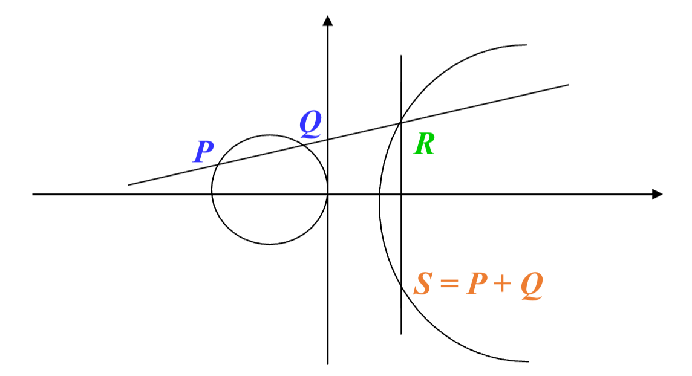

# Ch2 基于身份和属性的密码
## 椭圆曲线预备知识

### 预备知识
#### 射影平面与仿射平面
- 域 $K$ 上的**射影平面** $\mathbb{P}^2(K)$：
    $$
    \mathbb{P}^2(K)=\{(X:Y:Z):X,Y,Z\in K\}\backslash\{(0:0:0)\}
    $$
    - 定义等价关系：$(X:Y:Z)=(kX:kY:kZ),k\in K^*$
- 域 $K$ 上 $\mathbb{P}^2(K)$ 的**仿射平面** $\mathbb{A}^2(K)$：
    $$
    \mathbb{P}^2(K) \leftrightarrow \mathbb{A}^2(K) = \{(x,y):x,y\in K\}
    $$
    - 坐标变换：
        - $(x:y:1)\leftarrow (x,y)$
        - $(X:Y:Z)\rightarrow\left(\frac{X}{Z},\frac{Y}{Z}\right), Z\neq0$
            - 无穷远点：$(1:Y:0)$ 或 $(0:1:0)$
    - $d$ 次齐次多项式: $f(rX,rY,rZ)=r^d\cdot f(X,Y,Z)$，$\forall r\in K$
        - 齐次化: $f(x,y)\rightarrow f\left(\frac{X}{Z},\frac{Y}{Z}\right)$，将非齐次的仿射方程转化为齐次的射影方程。
        - 去齐次化: $f(X,Y,Z)\rightarrow f(x,y,1)$，将齐次的射影方程转化为非齐次的仿射方程。

#### 代数曲线
- **代数曲线**：令 $C$ 为由**齐次多项式方程** $f(X,Y,Z)=0$ 为定义的曲线。若 $f(X,Y,Z)$ 的系数属于域 $K$，称 $C$ 为定义在 $K$ 上的代数曲线。集合
    $$
    C(K)=\left\{(x:y:z)\in \mathbb{P}^2(K):f(x,y,z)=0\right\}
    $$

    称为曲线 $C$ 的有理点集。
- **奇异点与非奇异点**：令 $P\in C(K)$，如果 $\left(\frac{\partial f}{\partial x}(P),\frac{\partial f}{\partial y}(P),\frac{\partial f}{\partial z}(P)\right)=(0,0,0)$，则称 $P$ 为 $C$ 的奇异点，否则称 $P$ 为 $C$ 的非奇异点。
    - 判断是否奇异点需要先将方程齐次化。
- **切线方程**：若 $P$ 为 $C$ 上的非奇异点，则 $C$ 上过 $P$ 的切线方程为
    $$
    L:\frac{\partial f}{\partial x}(P)X+\frac{\partial f}{\partial y}(P)Y+\frac{\partial f}{\partial z}(P)Z=0.
    $$
- **光滑曲线**：若 $C$ 上所有点均为非奇异点，称 $C$ 为光滑曲线。
- **有理映射**：设齐次方程 $F_1(X;Y;Z)=0$ 和 $F_2(X;Y;Z)=0$ 定义的代数曲线分别为 $C_1$ 和 $C_2$。若存在映射
    $$
    \begin{aligned}
    \phi: &C_1\longrightarrow C_2 \\
    &(x:y:z)\longmapsto (f_1(x,y,z):f_2(x,y,z):f_3(x,y,z))
    \end{aligned}
    $$
    其中 $f_i=\frac{p_i(X,Y,Z)}{q_i(X,Y,Z)}$，且 $p_i, q_i$ 均为齐次多项式，则称 $\phi$ 是一个有理映射。
- **双有理等价**：设齐次方程 $F_1(X;Y;Z)=0$ 和 $F_2(X;Y;Z)=0$ 定义的代数曲线分别为 $C_1$ 和 $C_2$。若存在有理映射
    $$
    \begin{aligned}
    \phi&=(f_1,f_2,f_3):C_1\to C_2 \\
    \psi&=(g_1,g_2,g_3):C_2\to C_1
    \end{aligned}
    $$

    使得 $\phi\circ\psi=\mathrm{id}_{C_1}$，则称 $C_1$ 和 $C_2$ 为双有理等价。
- **Bezout 定理**：设齐次方程 $F_1(X;Y;Z)=0$ 和 $F_2(X;Y;Z)=0$ 次数分别为 $d_1$ 和 $d_2$。则 $F_1(X;Y;Z)=0$ 和 $F_2(X;Y;Z)=0$ 相交点的个数为 $d_1d_2$（重点按重数计算）。

#### 平行线公理
- **仿射平面**：$\mathbb{A}^2(K)=\{(x,y):x,y\in K\} \leftarrow$ 平面直角坐标系
    - 平行线公理：任意两条平行直线不相交
    - $\ell_1:ax+by=c_1$；$\ell_2:ax+by=c_2$；则 $\ell_1\cap\ell_2=\emptyset$
- **射影平面**：$\mathbb{P}^2(K)=\{(X:Y:Z):X,Y,Z\in K\}\backslash\{(0:0:0)\} \leftarrow$ 射影平面坐标系
    - **无**平行线公理：射影平面中两条平行线相交，交点为**无穷远点**
    - $L_1:aX+bY=c_1Z$；$L_2:aX+bY=c_2Z$；则
        $$
        L_1\cap L_2=\begin{cases}(1:-\frac{a}{b}:0), & b\neq0 \\ (0:1:0), & b=0\end{cases}
        $$
        - $(0:1:0)$ 为任意垂直于 $X$ 轴的直线在无穷远处的交点。

### 椭圆曲线群
#### 椭圆曲线
- **椭圆曲线**：定义域 $K$ 上的椭圆曲线是指射影平面上的一条光滑的、亏格是 1 的代数曲线，并且存在定义在 $K$ 上的点。
- **性质**：域 $K$ 上的椭圆曲线是满足以下 Weierstrass 方程并具有无穷远点 $(0:1:0)$ 的光滑代数曲线：
    $$
    \begin{aligned}
    & Y^2Z+a_1XYZ+a_3YZ^2=X^3+a_2X^2Z+a_4XZ^2+a_6Z^3 \\
    & y^2+a_1xy+a_3y=x^3+a_2x^2+a_4x+a_6（仿射形式）
    \end{aligned}
    $$

    其中 $a_1,a_2,a_3,a_4,a_6\in K$ 满足某些明确的代数条件。
    - **无穷远点**：每条直线与椭圆曲线在无穷远处的交点。
    - 特别地，当 $F$ 的特征不为 2、3 时，椭圆曲线的 Weierstrass 方程双有理等价于：
        $$
        y^2=x^3+ax+b, \quad 4a^3+27b^2\neq0
        $$
    - 变换过程：
        $$
        \begin{aligned}
        & E:y^2+a_1xy+a_3y=x^3+a_2x^2+a_4x+a_6 \\
        \xrightarrow{x'=x,\quad y'=y+\frac{a_1x+a_3}{2}} & E':y'^2=x'^3+a_2'x'^2+a_4'x'+a_6' \\
        \xrightarrow{x''=x'+\frac{a_2'}{3},\quad y''=y'} & E'':y''^2=x''^3+ax''+b
        \end{aligned}
        $$

#### 椭圆曲线的有理点集
- **椭圆曲线的有理点集**：设 $E/\mathbb{F}:y^2+a_1xy+a_3y=x^3+a_2x^2+a_4x+a_6$，则 $E(F)$ 的有理点集为
    $$
    E(F)=\{(u,v)\in F^2 | v^2+a_1uv+a_3v=u^3+a_2u^2+a_4u+a_6\} \cup \{O\}
    $$
- 椭圆曲线密码一般定义在有限域上：$K=\mathbb{Z}_p$、$K=GF(2^n)$
- 计算有理点的步骤：
    1. 对每一 $u\in K$，计算 $a_1u+a_3$ 和 $u^3+a_2u^2+a_4u+a_6$
    2. 在 $K$ 上解二次方程：$y^2+(a_1u+a_3)y-(u^3+a_2u^2+a_4u+a_6)=0$ 得到 $v$ 的值

#### 椭圆曲线点群
- **椭圆曲线点群**：设 $E/\mathbb{F}:y^2+a_1xy+a_3y=x^3+a_2x^2+a_4x+a_6$，则 $E(F)$ 关于以下点加运算构成加法群，且无穷远点 $(0:1:0)$ 为加法单位元：
    
    - 令 $P, Q$ 为 $E(F)$ 上的任意两点
    - 过 $P$ 和 $Q$ 的直线 $L$ 与 $E$ 相交于第三个点 $R$
    - 过无穷远点和 $R$ 的直线 $L'$ 与 $E$ 相交于第三个点定义为 $P+Q$。
- **Bezout’s 定理**：每条射影直线与椭圆曲线的相交于 3 个点（重点按重数计数）。
- **性质**：**加法交换群**
    - **群性质**：
        - 零元存在：$O=(0:1:0)$，满足 $P+O=P$。
        - 单位元存在：对于每个 $P=(x,y)$，存在 $-P=(x,-y-a_1x-a_3)$ 使得 $P+(-P)=O$。
        - 结合律：对于任意 $P, Q, R\in E(F)$，满足 $(P+Q)+R=P+(Q+R)$，需要更多数学理论证明。
    - **交换性**：对于任意 $P, Q\in E(F)$，满足 $P+Q=Q+P$。

#### 椭圆曲线的基本运算
- **代数表示**：设 $P=(x_1, y_1)$，$Q=(x_2, y_2)$，计算 $S=P+Q=(x_3, y_3)$。
    - **点加运算**：$P\neq Q$
    - **倍点运算**：$P=Q$
- **计算方法**：
    1. 求过点 $P, Q(Q\neq-P)$ 的直线方程 $y=\lambda x+\mu$
        - $P\neq Q$，$\lambda=\frac{y_2-y_1}{x_2-x_1}$，$\mu=y_1-\lambda x_1$
        - $P=Q$（计算切线），$\lambda=\frac{3x_1^2+2a_2x_1+a_4-a_1y_1}{2y_1+a_1x_1+a_3}$，$\mu=y_1-\lambda x_1$
    2. 将直线方程与椭圆曲线方程联立解得 $S=(x_3, y_3)$
        $$
        x^3+a_2x^2+a_4x+a_6-(\lambda x+\mu )^2-a_1x(\lambda x+\mu )-a_3(\lambda x+\mu )=(x-x_1)(x-x_2)(x-x_3) = 0
        $$

        解得
        $$
        (x_3,y_3)=(\lambda^2+a_1\lambda -a_2-x_2-x_1, -\lambda x_3-\mu -a_1x_3-a_3)$$

        特别地，当椭圆曲线方程为 $y^2=x^3+ax+b$ 时，
        $$
        (x_3,y_3)=(\lambda^2 -x_2-x_1, \lambda(x_1 -x_3)-y_1)
        $$

#### 有限域上的椭圆曲线
- **点的个数**
    - **估计**（Hasse-Weil bound）：Hasse 关于有限域 $\mathbb{F}_q$上椭圆曲线点的个数估计：
        $$
        q+1-2\sqrt{q} \leq \# E\left(\mathbb{F}_{q}\right) \leq q+1+2\sqrt{q}
        $$
    - **计算**：求有限域 $\mathbb{F}_q$ 上椭圆曲线群元素个数的 SEA（Schoof Elkies Atkin）算法复杂度为 $O\left(log^6 q\right)$
- **点的阶数**：$P$ 是椭圆曲线 $E$ 上的一个点，若存在最小的正整数 $n$，使得 $nP=O$，则称 $n$ 是 $P$ 的阶数，或称 $P$ 为 $n$ 阶扭点（torsion）。一般取 $n$ 为大素数 $r$。
- **椭圆曲线密码体制基本运算**：多倍点运算，即标量乘（Scalar Multiplication），对 $m\in \mathbb{Z}_N$ 计算
    $$
    mP = \underbrace{P+P+\cdots+P}_{m\text{ 次}}
    $$

    计算复杂度为 $O(log m)$。
- **椭圆曲线离散对数问题**（ECDLP）：在椭圆曲线上考虑方程 $Q=kP$，$k<r$，则由 $k$ 和 $P$ 易求 $Q$，但由 $P$、$Q$ 求 $k$ 则是困难的。

### 椭圆曲线上的双线性对
#### 双线性对
- **双线性对**（Bilinear map）：设 $E_1$、$E_2$ 为有限域 $F_q$ 的两条椭圆曲线，且 $G_1 \leq E_1(F_q),G_2 \leq E_2(F_q),G_T \leq F_q^*$，则**双线性映射**
    $$
    e: G_1 \times G_2 \rightarrow G_T
    $$

    满足：$\forall P_1,P_2,P\in G_1, \forall Q_1,Q_2,Q\in G_2, \forall a, b\in \mathbb{Z}$，有：

    1. $e\left(P_1+P_2, Q\right)=e\left(P_1, Q\right)e\left(P_2, Q\right)$
    2. $e\left(P, Q_1+Q_2\right)=e\left(P, Q_1\right)e\left(P, Q_2\right)$
    3. $e(aP, bQ)=e(P, Q)^{ab}$
- 双线性对性质：
    - $e$ 是非退化的，即存在 $P, Q$ 使得 $e(P, Q) \neq 1_{G_T}$
    - $e$ 是有效计算的
    - 若 $G_1 =\langle P_1\rangle, G_2=\langle P_2\rangle, G_T=\langle g_T\rangle$ 为素数阶 $N$ 的循环群，则 $g_T=e(P_1, P_2)$ 是 $G_T$ 的生成元。

#### 配对群
- **配对群**：满足上述双线性对定义的七元组 $PG=(G_1, G_2, G_T, N, P_1, P_2, g_T, e)$ 称为配对群，其中：
    - $G_1 \leq E_1(F_q), G_2 \leq E_2(F_q), G_T \leq F_q^*$ 是三个循环群，$N$ 是它们的公共阶数
    - $P_1, P_2, g_T$ 分别是 $G_1, G_2, G_T$ 的生成元
    - $e: G_1 \times G_2 \rightarrow G_T$ 是满足双线性对定义的映射
- **配对群的分类**：
    1. **Type Ⅰ 对称配对**：$G_1=G_2$，可简记为 $PG=(G, G_T, N, P, g_T, e)$
    2. **Type Ⅱ 非对称配对**：$G_1 \neq G_2$，且存在从 $G_2$ 到 $G_1$ 的、可高效（PPT）计算的同构映射 $\psi: G_2 \to G_1$，即满足 $\forall a \in \mathbb{Z}_N, \psi(aP_2)=aP_1$
    3. **Type Ⅲ 非对称配对**：$G_1 \neq G_2$，且 $G_1$ 与 $G_2$ 之间不存在可高效（PPT）计算的同构映射 $\psi$
- **定理**：
    1. 对于 Type Ⅰ 对称配对群，$G$ 上的 DDH 问题不困难（但 $G$ 上的CDH问题可能仍然困难）
    2. 对于 Type Ⅱ 非对称配对群，$G_2$ 上的 DDH  问题不困难（但 $G_2$ 上的 CDH 问题、$G_1$ 上的 DDH 问题可能仍然困难）