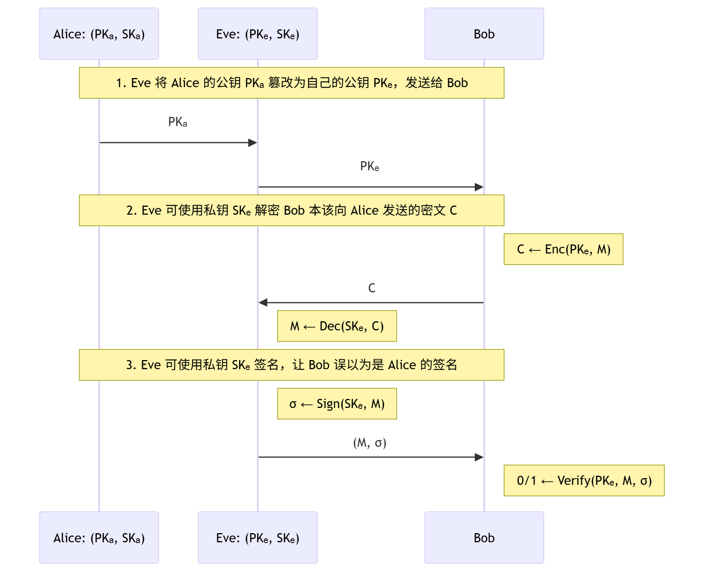
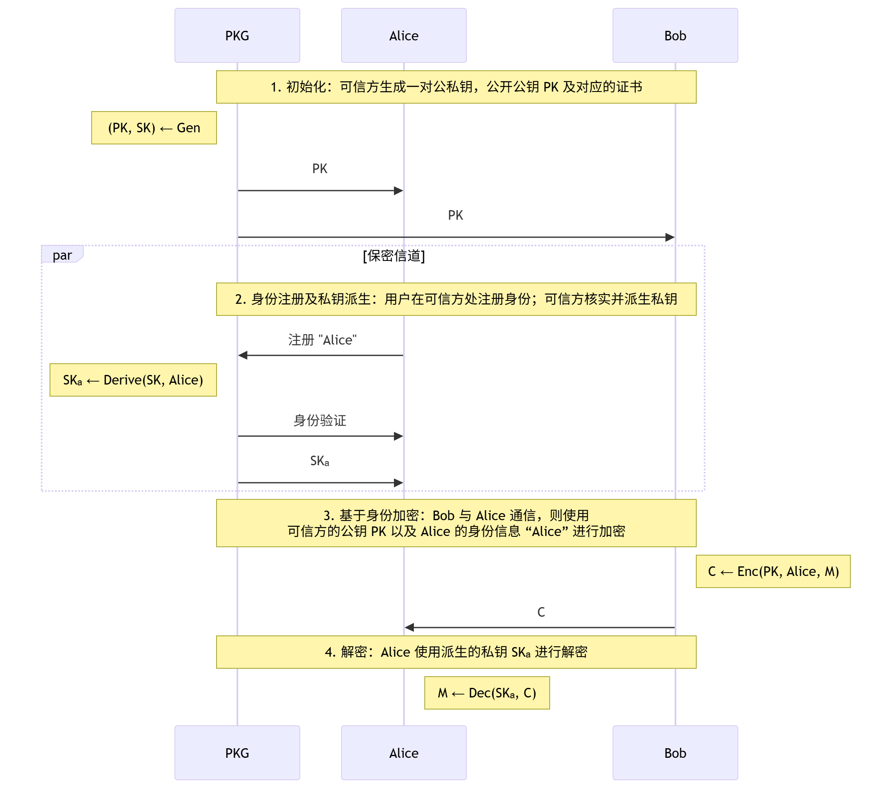
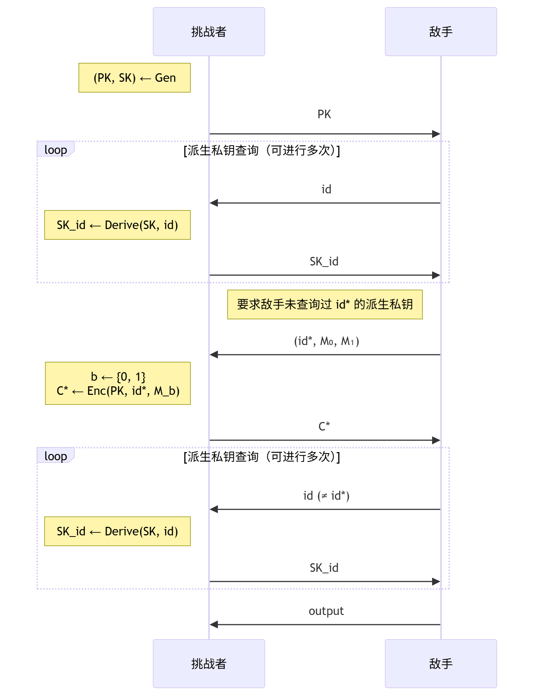

## 基于身份的加密
### 研究背景：公钥的安全分发和管理
#### 公钥分发
- 背景：只要获得了 Alice 的公钥 $PK_A$，Bob 就可以：
    - 通过使用公钥加密算法，与 Alice 进行秘密通信；
    - 通过使用数字签名算法，验证 Alice 的签名。
- 风险：公钥分发可能面临中间人攻击
    

#### 公钥基础设施 PKI
- **公钥基础设施**（PKI, Public-Key Infrastructures）是一个提供安全服务的基础设施，负责公钥证书的颁发、管理、存储、分发和撤销等功能。
- **认证中心**（CA）是 PKI 中的一个重要组成部分，负责验证用户真实身份并颁发数字证书，以及证书的管理和撤销。
- **数字证书**（Digital Certificate）是由 CA 颁发的电子文档，包含用户的公钥、身份信息、有效期等内容，并由 CA 的私钥进行签名。数字证书用于验证用户的身份和公钥的真实性。

#### 多用户场景下的公钥加密算法
- 流程：
    1. 安全的公钥分发：多用户各自生成公私钥对 $(PK_i, SK_i)$，并由 CA 颁发对应的证书；每个用户将自己的公钥 $PK_i$ 及对应的证书发送给 Bob。
    2. 公钥验证及存储：Bob 验证每个公钥 $PK_i$ 的证书；若验证通过则存储对应的公钥。
    3. 公钥加密：Bob 与 Alice 通信，则使用 Alice 的公钥 $PK_A$ 进行加密。
    4. 解密：Alice 使用私钥 $SK_A$ 进行解密。
- **缺点**：公钥分发与管理较为复杂，尤其在用户数量较多的情况下。
    - 分发 $N$ 个公钥及证书
    - 验证 $N$ 次公钥证书
    - 存储、管理、维护 $N$ 个公钥

### 基于身份的加密及其安全性
#### 基于身份的公钥
- **基于身份的公钥**（Identity-Based Public Keys）：一种特殊的公钥生成方式，其中用户的公钥直接由其身份信息（如电子邮件地址、学号/工号、手机号等）派生而来，无需通过 CA 颁发公钥证书。
- **私钥生成中心**（PKG, Private-Key Generator）：一个可信的实体，负责为每个用户生成并派发用户私钥。

#### 基于身份的加密算法
- **基于身份的加密算法**（Identity-Based Encryption, IBE）：一种公钥加密算法，可信方生成一对主密钥，根据用户身份信息派生用户私钥，用户使用基于身份的公钥进行加密，使用派生的私钥进行解密。
- **流程**：
    
- **优点**：公钥分发与管理更为简化
    - PKG 分发 $1$ 个公钥及证书
    - 验证 $1$ 次公钥证书
    - 存储、管理、维护 $1$ 个公钥

#### 基于身份加密算法的语义及正确性要求
- **语义**：一个基于身份的加密算法 $IBE$ 包含四个概率多项式时间 （PPT）算法 $(\mathrm{Gen}, \mathrm{Derive}, \mathrm{Enc}, \mathrm{Dec})$：
    1. **主密钥生成算法**：$(PK,SK)\leftarrow \mathrm{Gen}(1^\lambda)$，一般为概率性算法
    2. **私钥派生算法**：$SK_{id}\leftarrow \mathrm{Derive}(SK,id)$，其中 $id$ 为身份信息
    3. **加密算法**：$C\leftarrow \mathrm{Enc}(PK,id,M)$，$M\in\mathbb{M}$，其中 $\mathbb{M}$ 为消息空间
    4. **解密算法**：$M'\leftarrow \mathrm{Dec}(SK_{id},C)$，一般为确定性算法，$M'\in\mathbb{M}\cup\{\bot\}$，其中 $\bot$ 代表解密失败
- **正确性要求**：对于 $\forall (PK,SK)\leftarrow \mathrm{Gen}(1^\lambda)$，$\forall id$，$\forall SK_{id}\leftarrow \mathrm{Derive}(SK,id)$，$\forall M\in\mathbb{M}$，$\forall C\leftarrow \mathrm{Enc}(PK,id,M)$，一定有
    $$
    \mathrm{Dec}(SK_{id},C)=M
    $$

#### 基于身份加密算法的 IND-ID-CPA 安全性
- **基于身份的选择明文攻击**（Identity-based Chosen-Plaintext Attacks, ID-CPA）安全模型：
    
- **ID-CPA 敌手攻击能力**：
    - 输入：公开信道中的 $PK$ 及挑战密文 $C^{*}$
	- 运行时间：概率多项式时间 PPT
	- 攻击方式：
        1. **基于身份的选择明文攻击**：敌手可以提供/决定/影响加密使用的身份 $id^*$，以及加密使用的明文
        2. **选择派生私钥攻击**：敌手可以获得除 $id^*$ 外任意身份的派生私钥
- **IND 安全目标**：**不可区分性**（Indistinguishability）── 敌手无法区分密文 $C^{*}$ 加密的是 $M_{0}$ 还是 $M_{1}$（即如果 $\mathrm{output} = b$，则攻破该目标）
- **IND-ID-CPA 安全性定义**：任意 PPT 敌手在 ID-CPA 安全模型中攻破 IND 安全目标的优势是可忽略的，即
    $$
    Adv = \left|Pr(\mathrm{output} = b) - \frac{1}{2}\right| = \mathrm{negl}(\lambda)
    $$

### Boneh-Franklin 基于身份的加密算法
#### 具有双线性配对运算的椭圆曲线群
- **双线性配对群**（bilinear pairing group）：一个具有**双线性配对运算**的椭圆曲线群，简称为双线性配对群或配对群，是由多元组 $PG=(G_1,G_2,G_T,P_1,P_2,g_T,e)$ 所刻画，其中
    - $G_1=\langle P_1\rangle$，$G_2=\langle P_2\rangle$，$G_T=\langle g_T\rangle$ 均是循环群，阶均为素数 $N$.
    - $e:G_1\times G_2\to G_T$ 为一个 PPT 的**双线性配对运算**，满足
        1. 双线性性：$\forall a,b\in\mathbb{Z}_N$，$e(aP_1,bP_2)=e(P_1,P_2)^{ab}$。
        2. 非退化性：$e(P_1,P_2)=g_T$ 为 $G_T$ 的生成元。
- **对称配对群**：当 $G_1=G_2$ 时，称为对称配对群，可简记为 $PG=(G,G_T,N,P,g_T,e)$。

#### 椭圆曲线对称配对群上的 Bilinear DDH (BDDH) 问题
- **定理**：对于椭圆曲线**对称配对群** $G$，$G$ 上的 DDH 问题不困难。
- **BDDH 问题**：假设 $PG=(G,G_T,N,P,g_T,e)$ 为对称配对群，则
    1. 均匀选取 $x,y,z\leftarrow\mathbb{Z}_N$，计算 $T_0:=(g_T)^{xyz}$
    2. 均匀选取 $T_1\leftarrow G_T$，均匀选取 $\beta\leftarrow\{0,1\}$
    3. 输入：$(PG,xP,yP,zP,T_\beta)$
    4. 输出：$\mathrm{output}$
- **判定性 BDDH 问题困难**：任意 PPT 敌手的优势是可忽略的，即
    $$
    \begin{aligned}
    Adv &= \left|Pr(\mathrm{output}=\beta) - \frac{1}{2}\right| \\
    &= \frac{1}{2} \left|Pr(\mathrm{output}=0 \mid \beta=0) - Pr(\mathrm{output}=0 \mid \beta=1)\right| \\
    &= \mathrm{negl}(\lambda)
    \end{aligned}
    $$

#### BF 基于身份加密算法（椭圆曲线对称配对群）
- **组件**：Hash Function $H: \{0,1\}^* \to G$
- **密钥生成算法** $(PK,SK) \leftarrow \mathrm{Gen}(1^\lambda)$：
    1. 选择椭圆曲线对称配对群 $PG=(G,G_T,N,P,g_T,e)$
    2. 均匀选取 $s\leftarrow\mathbb{Z}_N$，计算 $Q:=sP\in G$
    3. 输出 $PK=(PG,Q)$，$SK=s$
- **私钥派生算法** $SK_{id} \leftarrow \mathrm{Derive}(SK,id)$，身份空间为 $\{0,1\}^*$
    1. 计算并输出 $SK_{id}:=sH(id)\in G$
- **加密算法**：$C \leftarrow Enc(PK,id,M)$，消息空间为 $\mathbb{M}=G_T$
    1. 均匀选取 $r\leftarrow\mathbb{Z}_N$
    2. 计算 $C_1:=rP\in G$
    3. 计算 $C_2:=e(Q,H(id))^r\cdot M\in G_T$
    4. 输出 $C:=(C_1,C_2)$
- **解密算法**：$M' \leftarrow Dec(SK_{id},C=(C_1,C_2))$
    1. 计算并输出 $M':=C_2/e(C_1,SK_{id})$

#### BF 基于身份加密算法的 IND-ID-CPA 安全性
- **定理**：**BDDH 问题困难** + **$H$ 为 RO** $\Rightarrow$ **BF 加密算法 IND-ID-CPA 安全**
- 思路：由攻破 IND-ID-CPA 安全性的敌手 $\mathcal{A}$ 来构造解决 BDDH 问题的敌手 $\mathcal{B}$
- 证明：安全性归约
