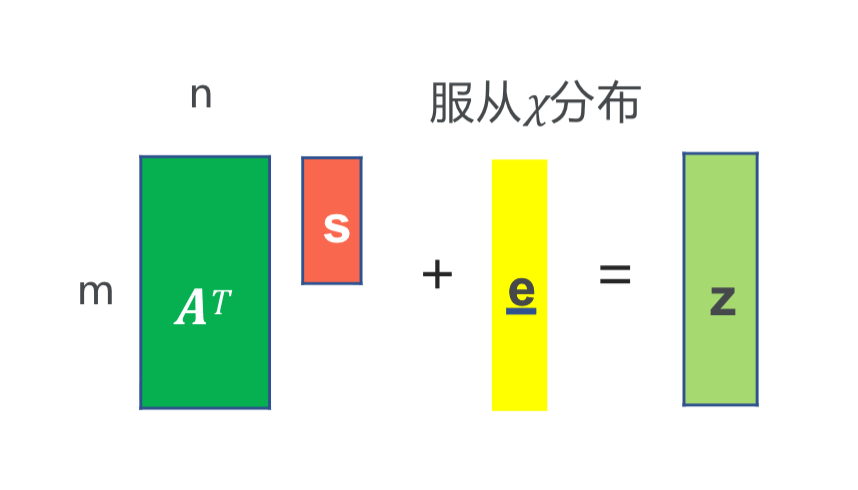
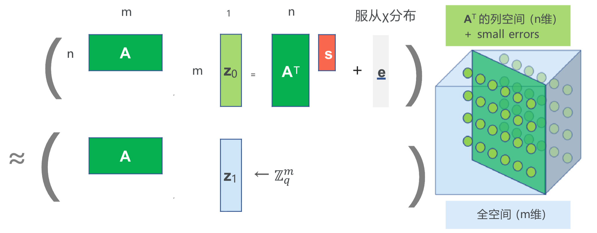
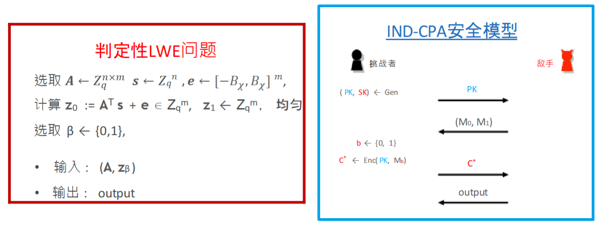
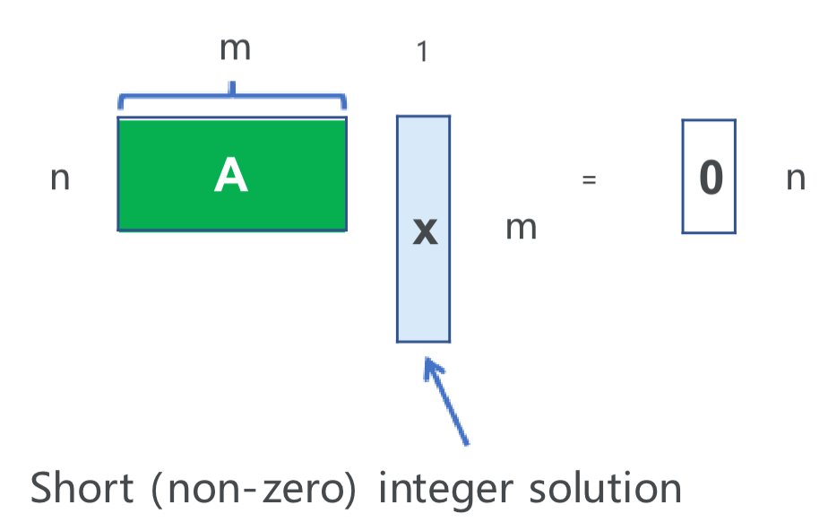

# 后量子密码
## 格理论以及基于格困难问题的密码学

### 格理论简介
#### 格的定义
- **格**（Lattice）：格 $\mathcal{L}$ 是 $\mathbb{R}^m$ 空间中离散的具有加法运算的子群。
    - $\mathbb{R}^m$ 空间：由 $m$ 维实数向量组成的空间。
        - 向量的范式：$\| \mathbf{x}\| =\sqrt{\sum_{i=1}^{m} x_i^2}$
        - 向量的距离：$\mathrm{dist}(\mathbf{x},\mathbf{y})=\| \mathbf{x}-\mathbf{y}\|$
    - 离散（Discrete）：每一个格点 $\mathbf{x} \in \mathcal{L}$，存在 $\mathbb{R}^{m}$ 中的一个领域仅包含 $\mathbf{x}$ 唯一格点;
    - 加法：
        - $(0,\cdots, 0) \in \mathcal{L}$
        - $\forall \mathbf{x},\mathbf{y} \in \mathcal{L}, \mathbf{x}-\mathbf{y} \in \mathcal{L}$
- 示例：$\mathbb{Z}^{m}$、$(q\mathbb{Z})^{m}$ 是格，但 $\mathbb{Q}^{m}$，$2\mathbb{Z}+ 1$ 以及 $\mathbb{Z}+\mathbb{Z}\sqrt{2}$ 都不是格。
- **格基**：设 $\mathcal{L}$ 是 $\mathbb{R}^{m}$ 中的格，则存在 $\mathbb{R}$-线性无关的向量 $\mathbf{b}_{1}, \mathbf{b}_{2}, \cdots, \mathbf{b}_{n} \in \mathbb{R}^{m}$，使得
    $$
    \mathcal{L}=\left\{z_{1} \mathbf{b}_{1}+z_{2} \mathbf{b}_{2}+\cdots+z_{n} \mathbf{b}_{n} \mid z_{i} \in \mathbb{Z}\right\}
    $$

    - **维数**：$m$
    - **秩**：$n$
    - **满秩格**：当 $m=n$ 时称 $\mathcal{L}$ 是满秩格
    - **格基**：$B=(\mathbf{b}_{1}, \mathbf{b}_{2}, \cdots, \mathbf{b}_{m})$
    - **格点**：向量 $\mathbf{v}=z_{1} \mathbf{b}_{1}+z_{2} \mathbf{b}_{2}+\cdots+z_{n} \mathbf{b}_{n} \in \mathcal{L}$
- **性质**：两组基 $B=\{\mathbf{b}_{1}, \cdots, \mathbf{b}_{n}\}$ 与 $B'=\{\mathbf{b}_{1}', \cdots, \mathbf{b}_{n}'\}$ 生成同一个格当且仅当存在一个幺模矩阵 $U \in \mathbb{Z}^{n\times n}$ 使得 $B=B' U$。
    - 幺模矩阵：$U$ 是一个整数矩阵，且 $\det U=\pm 1$。
- **基本平行多面体**（Fundamental parallelepipeds）：设 $\mathcal{L}$ 为满秩格，则格 $\mathcal{L}$ 的基本平行多面体定义为
    $$
    \mathcal{F}(B):= \mathbb{R}^{m}/\mathcal{L} = \{ \sum _{i=1}^{m}x_{i}\mathbf{b}_{i} \mid x_{i}\in [0,1)\}
    $$
    - $\mathcal{F}(B)$ 的体积为
        $$
        \mathrm{vol}(\mathcal {F}(B))=|\det M(B)|,\quad M(B)=\begin{pmatrix}\mathbf{b}_{1} & \mathbf{b}_{2} & \cdots & \mathbf{b}_{m}\end{pmatrix}
        $$
- **定理**：
    1. 设 $\mathbf{b}_{1}, \mathbf{b}_{2}, \cdots, \mathbf{b}_{m} \in \mathcal{L}$ 且整线性无关，则 $B=\{\mathbf{b}_{1}, \mathbf{b}_{2}, \cdots, \mathbf{b}_{m}\}$ 为格基当且仅当
        $$
        \mathcal{F}(B) \cap \mathcal{L}=\{(0, \cdots, 0)\}
        $$
    2. 设 $B=\{\mathbf{b}_{1}, \mathbf{b}_{2}, \cdots, \mathbf{b}_{m}\}$ 和 $B'=\{\mathbf{b}_{1}', \mathbf{b}_{2}', \cdots, \mathbf{b}_{m}'\}$ 为两组格基，则
        $$
        \mathrm{vol}(\mathcal{F}(B))=\mathrm{vol}\left(\mathcal{F}\left(B'\right)\right)
        $$
    3. 设 $B=\{\mathbf{b}_{1}, \mathbf{b}_{2}, \cdots, \mathbf{b}_{m}\}$ 为格基，定义 $\mathcal{L}$ 的行列式为
        $$
        \det(\mathcal{L}):=\mathrm{Vol}(\mathcal{F}(B))=|\det(B)|
        $$

#### 格上定义的问题
- **格的最小距离**：设 $\mathcal{L}$ 是 $\mathbb{R}^{m}$ 中的格，则 $\mathcal{L}$ 的最小距离定义为
    $$
    \lambda_{1}(\mathcal{L})=\min\{\| \mathbf{v}\| : \mathbf{v} \in \mathcal{L} \setminus\{0\}\}=\min\{\| \mathbf{x}-\mathbf{y}\| : \mathbf{x} \neq \mathbf{y} \in \mathcal{L}\}
    $$
- **Minkowski’s first theorem**：设 $\mathcal{L}$ 为秩是 $m$ 的格，则
    $$
    \lambda_{1}(\mathcal{L}) \leq \sqrt{m}(\det \mathcal{L})^{1/m}
    $$
    - 示例：$\mathbf{b}_{1}=(0,2^{-100})$，$\mathbf{b}_{2}=(2^{100}, 0)$ 那么 $\lambda_{1}(\mathcal{L}(\mathbf{b}_{1}, \mathbf{b}_{2}))=2^{-100} \ll \sqrt{2}$。

- **最短向量问题** $(SVP)$：给定格 $\mathcal{L}$ 的任意格基 $B$，找到 $\mathbf{v} \in \mathcal{L}\setminus\{0\}$ 使得
    $$
    \| \mathbf{v}\| =\lambda_{1}(\mathcal{L})
    $$
- **最近向量问题** $(CVP)$：给定格 $\mathcal{L}$ 的任意格基 $B$，以及 $t \in \mathbb{R}^{m}$，找到 $\mathbf{v} \in \mathcal{L}$ 使得
    $$
    \forall \mathbf{y} \in \mathcal{L}, \| \mathbf{v}-\mathbf{t}\| \leq \| \mathbf{y}-\mathbf{t}\|
    $$
- **近似最短向量问题** $(SVP_{\gamma})$：给定格 $\mathcal{L}$ 的任意格基 $B$，找到 $\mathbf{v} \in \mathcal{L}\setminus\{0\}$ 使得
    $$
    \| \mathbf{v}\| ≤\gamma(m) \cdot \lambda_{1}(\mathcal{L})
    $$
- **近似最近向量问题** $(CVP_{\gamma})$：给定格 $\mathcal{L}$ 的任意格基 $B$，以及 $t \in \mathbb{R}^{m}$，找到 $\mathbf{v} \in \mathcal{L}$ 使得
    $$
    \forall \mathbf{y} \in \mathcal{L}, \| \mathbf{v}-\mathbf{t}\| \leq \gamma(m) \cdot\| \mathbf{y}-\mathbf{t}\|
    $$
- **判定性近似最短向量问题** $(GapSVP_{\gamma})$：假设 $\mathcal{L}$ 是满足 $\lambda_{1}(\mathcal{L})\leq1$ 或 $\lambda_{1}(\mathcal{L})>\gamma(n)$ 的格，给定格 $\mathcal{L}$ 的任意格基 $B$，判断 $\mathcal{L}$ 属于哪种情况。
- **近似最短独立向量问题** $(SIVP_{\gamma})$：给定格 $\mathcal{L}$ 的任意格基 $B$，找到 $n$ 个线性无关向量 $s_{i}\in \mathcal{L}$，使得
    $$
    \|s_{i}\|\leq\gamma(n)\cdot\lambda_{n}(\mathcal{L})
    $$ 其中 $\lambda_{n}(\mathcal{L})$ 表示 $\mathcal{L}$ 的第 $n$ 小距离。
- **有界距离解码问题** $(BDD_{\delta})$：给定格 $\mathcal{L}$ 的任意格基 $B$，以及 $\mathbf{t} \in \mathbb{R}^{m}$，满足 $\mathrm{dist}(\mathcal{L}, \mathbf{t}) \leq\delta<\frac{\lambda_{1}(\mathcal{L})}{2}$，找到唯一的格向量 $\mathbf{w} \in \mathcal{L}$，使得
    $$
    \| \mathbf{w}-\mathbf{t}\| _{2} \leq \delta
    $$
    - $BDD_{\delta} \subset CVP_{\delta}$
    - $BDD_{\delta}$ 的计算复杂度随着维度 $n$ 和参数 $\delta$ 的增大而增加。
- **定理**：$SVP_{\gamma(m)} \leq_{P} CVP_{\gamma(m)}$。

### LWE 问题（Learning with Errors）
- **计算性 LWE 问题**（CLWE）：$n,m$ 为整数，$q$ 为正整数，$\chi$ 为区间 $[-B_{\chi}, B_{\chi}]$ 上的概率分布。均匀选取 $\mathbf{A} \leftarrow \mathbb{Z}_{q}^{n\times m}$，$\mathbf{s} \leftarrow \mathbb{Z}_{q}^{n}$，根据 $\chi$ 分布选取 $\mathbf{e} \leftarrow[-B_{\chi}, B_{\chi}]^{m}$，计算 $\mathbf{z}:=\mathbf{A}^{\top} \mathbf{s}+\mathbf{e} \in \mathbb{Z}_{q}^{m}$。
    - **输入**：$(\mathbf{A}, \mathbf{z})$
    - **输出**：$\mathbf{s}$
    - **计算性 LWE 问题困难**：任意 PPT 敌手的优势是可忽略的，即
        $$
        \mathrm{Adv} = \left|\Pr(\mathrm{output}=\mathbf{s}) - \frac{1}{q^{n}}\right| = \mathrm{negl}(\lambda)
        $$
    - 直觉：定义格 $\mathcal{L}(\mathbf{A})=\{\mathbf{x} \in \mathbb{Z}^{m} \mid \mathbf{x}=\mathbf{A}^{T} \mathbf{s} \pmod q, \mathbf{s} \in \mathbb{Z}_{q}^{n}\}$，则 $\mathbf{z}$ 是 $\mathcal{L}(\mathbf{A})$ 中某个格点附近的一个点，$\mathbf{e}$ 是噪声。
        
- **判定性 LWE 问题**（DLWE）：$n,m$ 为整数，$q$ 为正整数，$\chi$ 为区间 $[-B_{\chi}, B_{\chi}]$ 上的概率分布。均匀选取 $\mathbf{A} \leftarrow \mathbb{Z}_{q}^{n\times m}$，$\mathbf{s} \leftarrow \mathbb{Z}_{q}^{n}$，根据 $\chi$ 分布选取 $\mathbf{e} \leftarrow[-B_{\chi}, B_{\chi}]^{m}$，计算 $\mathbf{z}_{0}:=\mathbf{A}^{\top} \mathbf{s}+\mathbf{e} \in \mathbb{Z}_{q}^{m}$，$\mathbf{z}_{1} \leftarrow \mathbb{Z}_{q}^{m}$，均匀选取 $\beta \leftarrow\{0,1\}$。
    - **输入**：$(\mathbf{A}, \mathbf{z}_{\beta})$
    - **输出**：$\beta$
    - **判定性 LWE 问题困难**：任意 PPT 敌手的优势是可忽略的，即
        $$
        \mathrm{Adv} = \left|\Pr(\mathrm{output}=\beta) - \frac{1}{2}\right| = \mathrm{negl}(\lambda)
        $$
    - 
- **定理（Regev05）**：**判定性 LWE 问题困难** $\iff$ **计算性 LWE 问题困难**
- **LWE 问题的困难性**：LWE 问题可以归约到格中的困难问题，因此 LWE 被公认为是抗量子的。
    - 对于任意 $m=\mathrm{poly}(n)$，任意模数 $q \leq 2^{\mathrm{poly}(n)}$，以及任何（离散化的）参数为 $\alpha q \geq 2\sqrt{n}$ 的高斯误差分布 $\chi$，解决判定性 LWE 问题至少和量子地解决任意 $n$ 维格上的 $GapSVP_{\gamma}$ 和 $SIVP_{\gamma}$ 一样困难，其中 $\gamma = \tilde{O}(n/\alpha)$。

### Regev 公钥加密算法
#### Regev 公钥加密算法（加密 1 比特）
- **参数**：LWE 参数 $(n,m,q,B_{\chi},\chi)$ 满足：
    1. $m \cdot B_{\chi} < q/4$
    2. $m \geq 2n \cdot \log q$
- **密钥生成算法** $(PK,SK)\leftarrow \mathrm{Gen}(1^{\lambda})$：
    1. 均匀选取 $\mathbf{A}\leftarrow\mathbb{Z}_{q}^{n\times m}$
    2. 均匀选取 $\mathbf{s}\leftarrow\mathbb{Z}_{q}^{n}$，$\mathbf{e}\leftarrow[-B_{\chi},B_{\chi}]^{m}$，计算 $\mathbf{h}:=\mathbf{A}^{\top}\mathbf{s}+\mathbf{e}\in\mathbb{Z}_{q}^{m}$
    3. 输出 $PK=(\mathbf{A},\mathbf{h})$，$SK=\mathbf{s}$
- **加密算法** $C\leftarrow \mathrm{Enc}(PK,M)$：消息空间为 $\mathbb{M}=\{0,1\}$
    1. 均匀选取 $\mathbf{r}\leftarrow\{0,1\}^{m}$
    2. 计算 $\mathbf{c}_{1}:=\mathbf{A}\cdot \mathbf{r}\in\mathbb{Z}_{q}^{n}$
    3. 计算 $c_{2}:=\mathbf{r}^{\top}\mathbf{h}+M\cdot\lfloor q/2\rceil\in\mathbb{Z}_{q}$
    4. 输出 $C:=(\mathbf{c}_{1},c_{2})$
- **解密算法** $M'\leftarrow \mathrm{Dec}(SK,C=(\mathbf{c}_{1},c_{2}))$:
    1. 计算 $d:=c_{2}-\mathbf{c}_{1}^{\top}\mathbf{s}\in\mathbb{Z}_{q}$
    2. 如果 $d\approx0$，输出 $M':=0$；如果 $d\approx\lfloor q/2\rceil$，输出 $M':=1$
- **正确性分析**：对于 $\forall PK=(\mathbf{A},\mathbf{h})=(\mathbf{A},\mathbf{A}^{\top}\mathbf{s}+\mathbf{e})$，其中 $\mathbf{e}\leftarrow[-B_{\chi},B_{\chi}]^{m}$；$\forall C=(\mathbf{c}_{1},c_{2})=(\mathbf{A}\mathbf{r},\mathbf{r}^{\top}\mathbf{h}+M\cdot\lfloor q/2\rceil)$，其中 $\mathbf{r}\leftarrow\{0,1\}^{m}$：
    - 解密时，有
        $$
        \begin{aligned}
        d &=\mathbf{c}_{2}-\mathbf{c}_{1}^{\top}\mathbf{s} \\
        &=\mathbf{r}^{\top}\mathbf{h}+M\cdot\lfloor q/2\rceil-(\mathbf{A}\mathbf{r})^{\top}\mathbf{s} \\&=\mathbf{r}^{\top}(\mathbf{A}^{\top}\mathbf{s}+\mathbf{e})+M\cdot\lfloor q/2\rceil-(\mathbf{A}\mathbf{r})^{\top}\mathbf{s} \\
        &=\mathbf{r}^{\top}\mathbf{e}+M\cdot\lfloor q/2\rceil
        \end{aligned}
        $$
    - 由于 $\mathbf{e}\leftarrow[-B_{\chi},B_{\chi}]^{m}$，$\mathbf{r}\leftarrow\{0,1\}^{m}$，因此 $\mathbf{r}^{\top}\mathbf{e}\in[-mB_{\chi},mB_{\chi}]\subseteq(-q/4,q/4)$
        - 如果 $M=0$，则 $d=\mathbf{r}^{\top}\mathbf{e}\in(-q/4,q/4)=[0,q/4)\cup(3q/4,q-1]$
        - 如果 $M=1$，则 $d=\mathbf{r}^{\top}\mathbf{e}+\lfloor q/2\rceil\in(-q/4,q/4)+\lfloor q/2\rceil=(q/4,3q/4)$
    - 综上：
        - 当 $M=0$ 时，$d\approx0$，则 $M'=0$
        - 当 $M=1$ 时，$d\approx\lfloor q/2\rceil$，则 $M'=1$

#### Regev 公钥加密算法（加密 $\ell$ 比特）
- 设计思想：
    1. Regev 算法（加密 1 比特）
    2. 并行 $\ell$ 次（共用 $A$ 和 $r$）
- **密钥生成算法** $(PK,SK)\leftarrow \mathrm{Gen}(1^{\lambda})$：
    1. 均匀选取 $\mathbf{A}\leftarrow\mathbb{Z}_{q}^{n\times m}$
    2. 均匀选取 $\mathbf{S}\leftarrow\mathbb{Z}_{q}^{n\times\ell}$，$\mathbf{E}\leftarrow[-B_{\chi},B_{\chi}]^{m\times\ell}$，计算 $\mathbf{H}:=\mathbf{A}^{T}\mathbf{S}+\mathbf{E}\in\mathbb{Z}_{q}^{m\times\ell}$
    3. 输出 $PK=(\mathbf{A},\mathbf{H})$，$SK=\mathbf{S}$
- **加密算法** $C\leftarrow \mathrm{Enc}(PK, \mathbf{M}=(M_{1},\cdots,M_{\ell}))$：消息空间为 $\mathbb{M}=\{0,1\}^{\ell}$
    1. 均匀选取 $\mathbf{r}\leftarrow\{0,1\}^{m}$
    2. 计算 $\mathbf{c}_{1}:=\mathbf{A}\cdot \mathbf{r}\in\mathbb{Z}_{q}^{n}$
    3. 计算 $\mathbf{c}_{2}:=\mathbf{r}^{\top}\mathbf{H}+(M_{1}\cdot\lfloor q/2\rceil,\cdots,M_{\ell}\cdot\lfloor q/2\rceil)\in\mathbb{Z}_{q}^{1\times\ell}$（简记为$M\cdot\lfloor q/2\rceil$）
    4. 输出 $C:=(\mathbf{c}_{1},\mathbf{c}_{2})$
- **解密算法** $M'\leftarrow \mathrm{Dec}(SK,C=(\mathbf{c}_{1},\mathbf{c}_{2}))$：
    1. 计算 $\mathbf{d}:=\mathbf{c}_{2}-\mathbf{c}_{1}^{\top}\mathbf{S}\in\mathbb{Z}_{q}^{1\times\ell}$；将 $\mathbf{d}$ 按分量展开为 $(d_{1},\cdots,d_{\ell})$
    2. $\forall i\in\{1,\cdots,\ell\}$：如果 $d_{i}\approx0$，$M_{i}':=0$；如果 $d_{i}\approx\left\lfloor\frac{q}{2}\right\rceil$，$M_{i}':=1$
    3. 输出 $\mathbf{M}':=(M_{1}',\cdots,M_{\ell}')$

#### 1 比特 Regev 算法的 IND-CPA 安全性
- **定理**：**判定性 LWE 问题困难** $\implies$ **1 比特 Regev 算法是 IND-CPA 安全的**
    - **思路**：正向证明，给定任意 PPT 敌手 $\mathcal{A}$，证明其攻破 IND-CPA 安全性的优势是可忽略的
        $$
        \mathrm{Adv}_{\mathcal{A}}=\left|\Pr(\mathrm{output}=b)-\frac{1}{2}\right|=\mathrm{negl}(\lambda)
        $$ 

!!! fold info @Proof
    - **证明**：采用混合论证（Hybrid Arguments）与三角不等式。
        
        - **定义混合游戏**：
            - **Game 0**：IND-CPA 安全模型
                1. 挑战者执行 $\mathrm{Gen}: \mathbf{A}\leftarrow\mathbb{Z}_{q}^{n\times m}$，$\mathbf{s}\leftarrow\mathbb{Z}_{q}^{n}$，$\mathbf{e}\leftarrow[-B_{\chi},B_{\chi}]^{m}$，$\mathbf{h}:=\mathbf{A}^\top \mathbf{s}+\mathbf{e}$，输出 $PK=(\mathbf{A},\mathbf{h})$
                2. 敌手提交 $(M_0,M_1)$
                3. 挑战者随机选 $b\leftarrow\{0,1\}$，加密 $C^*\leftarrow \mathrm{Enc}(PK,M_b): \mathbf{r}\leftarrow\{0,1\}^m$，$\mathbf{c}_1:=\mathbf{A}\mathbf{r}$，$c_2:=r^Th+M_b\cdot\lfloor q/2\rceil$，输出 $C^*=(\mathbf{c}_1,c_2)$
                4. 敌手输出猜测结果
            - **Game 1**：$PK$ 中的 $h\leftarrow\mathbb{Z}_{q}^{m}$
                1. **密钥生成步骤**改为：均匀选取 $\mathbf{A}\leftarrow\mathbb{Z}_{q}^{n\times m}$，$\mathbf{h}\leftarrow\mathbb{Z}_{q}^{m}$，输出 $PK=(\mathbf{A},\mathbf{h})\leftarrow\mathbb{Z}_{q}^{n\times m}\times\mathbb{Z}_{q}^{m}$
                2. 后续步骤与 Game 0 一致
            - **Game 2**：$C^*\leftarrow\mathbb{Z}_{q}^{n}\times\mathbb{Z}_{q}$
                1. 前序步骤与 Game 1 一致
                2. **加密步骤**改为：均匀选取 $\mathbf{c}_1\leftarrow\mathbb{Z}_{q}^{n}$，$c_2\leftarrow\mathbb{Z}_{q}$，$C^*=(\mathbf{c}_1,c_2)\leftarrow\mathbb{Z}_{q}^{n}\times\mathbb{Z}_{q}$
                3. 敌手输出猜测结果
        - **混合游戏性质**：
            1. Game 0 与 Game 1 的区别只在于 $PK$ 中的 $\mathbf{h}$ 的生成：
                - Game 0 中 $\mathbf{h}=\mathbf{A}^{\top}\mathbf{s}+\mathbf{e}$
                - Game 1 中 $\mathbf{h}\leftarrow\mathbb{Z}_{q}^{m}$
            2. 由**引理1**：Game 0 与 Game 1 不可区分，即
                $$
                |\Pr(\mathrm{output}=b\mid \text{Game 0}) - \Pr(\mathrm{output}=b\mid \text{Game 1})| = \mathrm{negl}(\lambda)
                $$
            2. Game 1 与 Game 2 的区别只在于密文 $C^{*}=(\mathbf{c}_{1},c_{2})$ 的生成：
                - Game 1 中 $(\mathbf{c}_{1},c_{2})=(\mathbf{A}\mathbf{r},\mathbf{r}^{\top}\mathbf{h}+M_b\cdot\lfloor q/2\rceil)$
                - Game 2 中 $(\mathbf{c}_1,c_2)\leftarrow\mathbb{Z}_{q}^{n}\times\mathbb{Z}_{q}$
            3. 由**引理2（剩余哈希引理）推论**：Game 1 与 Game 2 不可区分，即
                $$
                |\Pr(\mathrm{output}=b\mid \text{Game 1}) - \Pr(\mathrm{output}=b\mid \text{Game 2})| = \mathrm{negl}(\lambda)
                $$
            4. Game 2 中，$C^{*}=(\mathbf{c}_{1},c_{2})$ 中已经不含 $b$ 的信息，因此
                $$
                \Pr(\mathrm{output}=b\mid \text{Game 2})=\frac{1}{2}
                $$
        - **由三角不等式**：
            $$
            \begin{aligned}
            \mathrm{Adv}_{A} =& \left| \Pr(\mathrm{output}=b\mid \text{Game 0}) - \frac{1}{2} \right| \\
            \leq& \left| \Pr(\mathrm{output}=b\mid \text{Game 0}) - \Pr(\mathrm{output}=b\mid \text{Game 1}) \right|+ \\
            & \left| \Pr(\mathrm{output}=b\mid \text{Game 1}) - \Pr(\mathrm{output}=b\mid \text{Game 2}) \right|+ \\
            & \left| \Pr(\mathrm{output}=b\mid \text{Game 2}) - \frac{1}{2} \right| \\
            =& \mathrm{negl}(\lambda) + \mathrm{negl}(\lambda) + 0 \\
            =& \mathrm{negl}(\lambda)
            \end{aligned}
            $$
        - 因此 $\mathrm{Adv}_{A}=\mathrm{negl}(\lambda)$，得证 IND-CPA 安全性。

- **引理 1**：**判定性 LWE 问题困难** $\implies$ Game 0 与 Game 1 不可区分，即
    $$
    |\Pr(\mathrm{output}=b\mid \text{Game 0}) - \Pr(\mathrm{output}=b\mid \text{Game 1})| = \mathrm{negl}(\lambda)
    $$
    - 证明思路：采用反证法（安全性归约），由区分 Game 0 与Game 1 的敌手 $\mathcal{A}$ 来构造解决判定性 LWE 问题的敌手 $\mathcal{B}$。
- **引理 2**：
    - **剩余哈希引理**（Leftover Hash Lemma）: 当 $q$ 为素数且 $m\geq n\log q+2\log(1/\epsilon)$ 时，任意敌手区分下面两个分布的优势为可忽略的
        $$
        (\mathbf{H},\mathbf{Hr})\approx_s(\mathbf{H},\mathbf{u})
        $$

        其中 $\mathbf{H}\leftarrow\mathbb{Z}_{q}^{n\times m}$，$\mathbf{r}\leftarrow\{0,1\}^{m}$，$\mathbf{u}\leftarrow\mathbb{Z}_{q}^{n}$。
    - **推论**：当 $q$ 为素数且 $m\geq2n\cdot\log q$ 时，任意敌手区分下面两个分布的优势为可忽略的
        $$
        \begin{pmatrix}\begin{pmatrix}\mathbf{A} \\ \mathbf{h}^\top \end{pmatrix},\begin{pmatrix}\mathbf{Ar} \\ \mathbf{h}^\top\mathbf{r} \end{pmatrix} \end{pmatrix}
        \approx_s
        \begin{pmatrix}\begin{pmatrix}\mathbf{A} \\ \mathbf{h}^\top \end{pmatrix},\begin{pmatrix}\mathbf{u}_1 \\ \mathbf{u}_2 \end{pmatrix} \end{pmatrix}
        $$

        其中 $\mathbf{A}\leftarrow\mathbb{Z}_{q}^{n\times m}$，$\mathbf{h}\leftarrow\mathbb{Z}_{q}^{m}$，$\mathbf{r}\leftarrow\{0,1\}^{m}$，$\mathbf{u}_{1}\leftarrow\mathbb{Z}_{q}^{n}$，$\mathbf{u}_{2}\leftarrow\mathbb{Z}_{q}$。

#### $\ell$ 比特 Regev 算法的 IND-CPA 安全性
- **定理**：**判定性 LWE 问题困难** $\implies$ **$\ell$ 比特 Regev 算法是 IND-CPA 安全的**
    - 思路：采用混合论证，结合剩余哈希引理与 LWE 假设。
        - 混合论证：
            - **Game 0**（IND-CPA 安全模型）中：$\mathbf{H}=\mathbf{A}^{\top}\mathbf{S}+\mathbf{E}$，$\mathbf{c}_1=\mathbf{A}\mathbf{r}$，$\mathbf{c}_2=\mathbf{r}^{\top}\mathbf{H}+\mathbf{M}\cdot\lfloor q/2\rceil$
            - **Game 1** 中：$\mathbf{H}\leftarrow\mathbb{Z}_{q}^{m\times\ell}$
            - **Game 2** 中：$\mathbf{c}_{1}\leftarrow\mathbb{Z}_{q}^{n}$，$\mathbf{c}_{2}\leftarrow\mathbb{Z}_{q}^{1\times\ell}$
        - 通过 LWE 假设（每次换 $H$ 的第 $i$ 列，共混合论证 $\ell$ 次）证明 Game 0 与 Game 1不可区分。
        - 通过剩余哈希引理证明 Game 1与 Game 2不可区分，最终得证 IND-CPA 安全性。

### SIS 困难问题与 GPV 签名算法
#### SIS 问题（Short Integer Solution）
- **SIS 问题**：$n,m$ 为整数，$q$ 为正整数，$B_{s}$ 为整数。均匀选取 $\mathbf{A} \leftarrow\mathbb{Z}_{q}^{n\times m}$。
    - **输入**：$\mathbf{A}$
    - **输出**：$\mathbf{x}\in\mathbb{Z}_{q}^{m}$ 满足
        1. $\mathbf{Ax}=\mathbf{0}\in\mathbb{Z}_{q}^{n}$
        2. $\mathbf{x}\neq\mathbf{0}$
        3. $\mathbf{x}\in[-B_{s},B_{s}]^{m}$
    - **SIS 问题困难**：任意 PPT 敌手的优势是可忽略的，即
        $$
        \Pr(\text{find such } \mathbf{x}) = \mathrm{negl}(\lambda)
        $$
    - 观察:
        1. 如果没有对于 $\mathbf{x}$ 的限制，使用高斯消元法很容易求解 $\mathbf{x}$。
        2. 对于 SIS 问题，$m$ 越大越容易，$n$ 越大越困难。
    - 直觉：定义格 $\mathcal{L}(\mathbf{A})=\{\mathbf{x}\in\mathbb{Z}^{m} \mid \mathbf{Ax}\equiv\mathbf{0}\pmod q\}$，SIS 问题要求找到 $\mathcal{L}(\mathbf{A})$ 中一个非零的短向量。
        
- **定理**：如果 $m\cdot B_{\chi}\cdot B_{s}<q/4$，则 **判定性 LWE 问题 $(n,m,q,\chi)$ 困难** $\implies$ **SIS 问题 $(n,m,q,B_{s})$ 困难**
    - 证明：由解决 SIS 问题的敌手 $\mathcal{A}$ 来构造解决判定性 LWE 问题的敌手 $\mathcal{B}$。

#### 原像可采样函数 PSF（Preimage Sampleable Function）
- PSF 参数：$(n,m,q,B)$
- **矩阵 A 的带陷门采样算法**：$(\mathbf{A},td)\leftarrow \mathrm{SampleA}(1^{\lambda})$
    - 矩阵 $\mathbf{A}$ 在 $\mathbb{Z}_{q}^{n\times m}$ 上均匀分布，$td$ 为陷门信息（trapdoor）
    - 定义函数
        $$
        \begin{aligned}
        f_{A}:\mathbb{Z}_{q}^{m}&\to\mathbb{Z}_{q}^{n} \\
        \mathbf{x} &\mapsto \mathbf{Ax}
        \end{aligned}
        $$
- **正向采样算法**：$(\mathbf{x}\in\mathbb{Z}_{q}^{m},\mathbf{y}\in\mathbb{Z}_{q}^{n})\leftarrow \mathrm{SampleTuple}(\mathbf{A})$
    - 向量 $\mathbf{x}$ 满足 $\mathbf{x}\in[-B,B]^{m}$
    - 向量 $\mathbf{y}$ 满足 $\mathbf{y}=\mathbf{A}\mathbf{x}$ 且在 $\mathbb{Z}_{q}^{n}$ 上均匀分布
- **原像采样算法**：$\mathbf{x}\in\mathbb{Z}_{q}^{m}\leftarrow \mathrm{SamplePre}(td,\mathbf{A},\mathbf{y}\in\mathbb{Z}_{q}^{n})$:
    - 向量 $\mathbf{x}$ 满足 $\mathbf{x}\in[-B,B]^{m}$ 且 $\mathbf{Ax}=\mathbf{y}$
- **关键性质**（GPV08）：下面两种 $(\mathbf{x}\in\mathbb{Z}_{q}^{m},\mathbf{y}\in\mathbb{Z}_{q}^{n})$ 的分布一样:
    - $(\mathbf{x}\in\mathbb{Z}_{q}^{m},\mathbf{y}\in\mathbb{Z}_{q}^{n})\leftarrow \mathrm{SampleTuple}(\mathbf{A})$
    - 先均匀选取 $\mathbf{y}\leftarrow\mathbb{Z}_{q}^{n}$，再调用 $\mathbf{x}\leftarrow \mathrm{SamplePre}(td,\mathbf{A},\mathbf{y})$

#### GPV 数字签名算法（Gentry-Peikert-Vaikuntanathan）
- 组件：
    1. PSF：参数 $(n,m,q,B)$
    2. Hash Function $\mathrm{H}:\{0,1\}^{*}\to\mathbb{Z}_{q}^{n}$
- **密钥生成算法** $(PK,SK)\leftarrow \mathrm{Gen}(1^{\lambda})$：
    1. 调用 $(\mathbf{A},td)\leftarrow \mathrm{SampleA}(1^{\lambda})$，其中 $\mathbf{A}$ 在 $\mathbb{Z}_{q}^{n\times m}$ 上均匀分布
    2. 输出 $PK=\mathbf{A}$，$SK=td$
- **签名算法** $\sigma\leftarrow \mathrm{Sign}(SK,M)$：消息空间为 $\mathbb{M}=\{0,1\}^{*}$
    1. 计算 $\mathrm{H}(M)\in\mathbb{Z}_{q}^{n}$
    2. 调用并输出 $\sigma\in\mathbb{Z}_{q}^{m}\leftarrow \mathrm{SamplePre}(td,\mathbf{A},\mathrm{H}(M))$
- **验证算法** $0/1\leftarrow \mathrm{Verify}(PK,M,\sigma)$：
    1. 验证  $\sigma\in[-B,B]^{m} \land \mathbf{A}\sigma\equiv \mathrm{H}(M) \pmod{q}$
    2. 如果验证通过，输出 $1$；否则输出 $0$

#### GPV 数字签名算法的 EUF-CMA安全性
- **定理**：**SIS 问题 $(n,m,q,B_{s}=2B)$ 困难** + **$\mathrm{H}$ 为 RO** $\implies$ **GPV 签名算法 EUF-CMA 安全**
    - 证明：安全性规约，由攻破 EUF-CMA 安全性的敌手 $\mathcal{A}$ 来构造解决 SIS 问题的敌手 $\mathcal{B}$。
