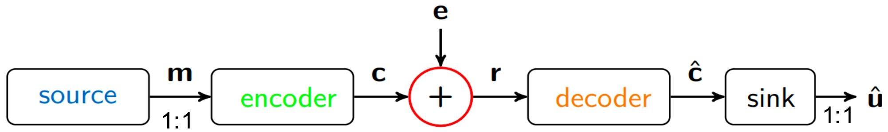

## 纠错码理论以及基于编码困难问题的密码学

### 通信系统模型与误差模型

- **通信系统的基本模型**：
    - 信源：产生长度为 $k$ 的消息 $m \in \sum^{k}$
    - 编码器：将消息 $m$ 编码为长度为 $n$ 的码字 $c \in \sum^{n}$（$m$ 与 $c$ 一一映射：增加冗余）
    - 信道：码字被错误 $e \in \sum^{n}$ 干扰，即 $r=c+e$
    - 译码器：仅根据接收字 $r$ 重构码字 $c$，从而恢复消息 $m$。
- **误差模型与可译码性**：
    - 通信系统中，采用随机替换误差模型，即已知比特位置存在未知错误值
    - 存储系统中，采用擦除误差模型，即已知错误位置且该位置值直接丢失
    - 密码学中，采用随机替换误差模型

### 有限域
#### 有限域
- 消息的元素来自有限域（字母表 $\sum$），因此需要了解有限域的相关知识。
- **域**：集合 $F$ 上定义了加法和乘法两种运算，满足：
    1. $(F, +)$ 是阿贝尔群，零元素记为 $0$；
    2. $(F \backslash\{0\}, \cdot)$ 是阿贝尔群，单位元素记为 $1$；
    3. 分配律：对所有 $a, b, c \in F$，有 $a \cdot(b+c)=a \cdot b+a \cdot c$。
- **有限域**：$F_{q}$ 为包含有限个 $q$ 个元素的域
    - 实际构造：$F_{q}$ 存在当且仅当 $q=p^{\ell}$ 为素数的幂
- **素域**（$p$ 为素数）：$F_{p}=\{0,\cdots,p-1\}$，运算为模 $p$ 的加法/乘法，例如 $F_{2}=\{0,1\}$；
- **扩域**（$F_{p}$ 为基域）：设 $f(x)$ 为 $F_{p}$ 上的首一不可约多项式，次数为 $\ell$，则
    $$
    \begin{aligned}
    F_{p^{\ell}}&=F_{p}[x]/(f(x)) \\
    &=\left\{a(x) \pmod{f(x)} \mid a(x) \in F_{p}[x]\right\} \\
    &=\left\{a(x) \in F_{p}[x]:\deg(a)<\ell\right\} \\
    &=\left\{a_{0}+a_{1} x+\cdots+a_{\ell-1} x^{\ell-1}: a_{i} \in F_{p} \right\}
    \end{aligned}
    $$
    - 运算：
        - 加法：按分量进行，各项系数模 $p$ 加法
        - 乘法：模 $f(x)$ 乘法
    - 性质：
        - $\# F_{p^{\ell}}=p^{\ell}$
        - $F_{p} \subseteq F_{p^{\ell}}$
        - $F_{p^{\ell}} \cong F_{p}^{\ell}$
    - 同理，可以以 $F_q =F_{p^{\ell}}$ 为基域构造扩域 $F_{q^m}$，满足 $F_{q^m} \cong F_{q}^{m}$。
- 任意两个同阶的有限域都是同构的。

#### 有限域上的向量空间
- **有限域上的向量空间**：设 $\mathbb{F}_{q}$ 为 $q$ 阶有限域，阿贝尔群 $V$ 被称为 $\mathbb{F}_{q}$ 上的向量空间，若存在 $\mathbb{F}_{q}$ 在 $V$ 上的数乘运算
    $$
    \begin{aligned}
    \mathbb{F}_{q} \times V &\to V \\
    (\lambda, x) &\mapsto \lambda x
    \end{aligned}
    $$
    满足以下公理：
    1. 对所有 $\lambda \in \mathbb{F}_{q}$ 和 $x,y \in V$，有 $\lambda(x+y)=\lambda x+\lambda y$；
    2. 对所有 $\lambda,\mu \in \mathbb{F}_{q}$ 和 $x \in V$，有 $(\lambda+\mu) x=\lambda x+\mu x$；
    3. 对所有 $\lambda,\mu \in \mathbb{F}_{q}$ 和 $x \in V$，有 $(\lambda \mu) x=\lambda(\mu x)$；
    4. 对所有 $x \in V$，有 $1x=x$。
- **线性张成**：设 $V$ 为 $\mathbb{F}_{q}$ 上的向量空间，$S=\{v_{1},\cdots,v_{k}\}$ 为 $V$ 的子集，$S$ 的线性张成定义为
    $$
    \langle S\rangle _{q}=\{\lambda_{1}v_{1}+\cdots+\lambda_{k}v_{k}:\lambda_{i}\in F_{q}\}
    $$

    特别地，$\langle\emptyset\rangle _{q}:=\{0\}$。则 $\langle S\rangle _{q}$ 是 $V$ 的线性子空间。
- **向量空间的基与维数**：设 $V$ 为 $\mathbb{F}_{q}$ 上的向量空间，$B=\{v_{1},\cdots,v_{k}\}$ 为 $V$ 的子集，若 $B$ 线性无关且 $\langle B\rangle _{q}=V$，则称 $B$ 是 $V$ 的一组基。基中的向量个数称为 $V$ 的维数，记为 $\dim(V)$。
- $F_{q^{m}}$ 是 $F_{q}$ 上维数为 $m$ 的向量空间。

### 线性码
#### 线性码的定义与表示
- **线性码**：设 $F_{q}$ 为 $q$ 阶有限域，$C \subseteq F_{q}^{n}$ 是 $F_{q}$ 上的 $k$ 维线性子空间，则称 $C$ 是 $[n, k]_{q}$ 线性码。
    - $C$ 的长度为 $n$
    - $C$ 的维数为 $k \leq n$，即 $C$ 可以由 $k$ 个线性无关的向量生成
    - $C$ 的码率为 $\frac{k}{n} \leq 1$，即存在冗余
    - $C$ 中的元素称为码字
- **线性码的表示与生成矩阵**：设 $G \in F_{q}^{k \times n}$ 的行向量 $g_{1},\cdots,g_{k}$ 构成 $C^{\perp}$ 的一组基，则 $C$ 可表示为
    $$
    C=\left\{m^{\top} G: m \in F_{q}^{k}\right\},\quad G=\begin{pmatrix} g_{1} \\ \vdots \\ g_{k} \end{pmatrix}_{k \times n}
    $$

    反之，任意秩为 $k$ 的矩阵 $G \in F_{q}^{k\times n}$ 都定义了一个 $[n, k]_{q}$ 码，称 $G$ 为 $C$ 的生成矩阵。

#### 线性码的对偶码与校验矩阵
- **内积**：设 $x=(x_{1},\cdots,x_{n})$ 和 $y=(y_{1},\cdots,y_{n})$ 是 $F_{q}^{n}$ 中的两个向量，则它们的内积定义为
    $$
    \langle x, y\rangle :=x_{1} y_{1}+\cdots+x_{n} y_{n} = \sum_{i=1}^{n} x_{i} y_{i}
    $$
- **对偶码**：设 $g_{1},\cdots,g_{k}$ 是 $C \subseteq F_{q}^{n}$ 的一组基，则 $C$ 的对偶码定义为
    $$
    \begin{aligned}
    C^{\perp}:=&\{ c^{*}\in F_{q}^{n} \mid \forall c\in C, \langle c,c^{*}\rangle =0\} \\
    =&\{c^{*} \in F_{q}^{n} \mid \forall i, \langle c^{*}, g_{i}\rangle =0\} \\
    =&\{c^{*} \in F_{q}^{n} \mid c^{*} G^{\top}=0\}
    \end{aligned}
    $$
    - **性质**：由于 $\dim(C^{\perp})=n-\dim(C)$，因此 $[n, k]_{q}$ 码 $C$ 的对偶码 $C^{\perp}$ 是 $[n, n-k]_{q}$ 码，且满足$(C^{\perp})^{\perp}=C$。
    - 说明：$C$ 与 $C^{\perp}$ 可能不构成直和，$C$ 的核定义为 $C \cap C^{\perp}$。
- **自对偶码**：$C=C^{\perp}$，则 $C$ 的维数为 $\frac{n}{2}$。
- **线性码的另一种表示与校验矩阵**：设 $H \in F_{q}^{(n-k) \times n}$ 的行向量 $h_{1},\cdots,h_{n-k}$ 构成 $C^{\perp}$ 的一组基，则 $HG^{\top}=0$，线性码 $C$ 可表示为
    $$
    C=\left\{c \in F_{q}^{n}: H c=0\right\},\quad H=\begin{pmatrix} h_{1} \\ \vdots \\ h_{n-k} \end{pmatrix}_{(n-k) \times n}
    $$

    反之，任意秩为 $n-k$ 的矩阵 $H \in F_{q}^{(n-k) \times n}$ 都定义了一个 $[n, k]_{q}$ 码，称 $H$ 为 $C$ 的校验矩阵。

#### 汉明度量
- **汉明重量**：对于 $x=(x_{1},\cdots,x_{n}) \in F_{q}^{n}$，其汉明重量定义为非零分量的个数，即
    $$
    \mathrm{wt}_{H}(x):=\# \{ x_{i}\neq 0 \mid 1\leq i\leq n\}
    $$
- **汉明距离**：两个向量 $x$ 和 $y$ 之间的汉明距离定义为
    $$
    d(x, y):=\mathrm{wt}_{H}(x-y)
    $$
    - **注**：汉明度量是一种仅能取 $n+1$ 个值 $(0,1,\cdots,n)$ 的度量，且与欧几里得度量不同，它不区分“大”和“小”的分量。例如在 $F_{11}^{3}$ 中，$\mathrm{wt}_{H}(5, 3, 0) = \mathrm{wt}_{H}(1, 0, 1) = 2$。
- **极小汉明距离**：线性码 $C$ 的极小汉明距离定义为非零码字的最小汉明重量，即
    $$
    d_{min}(C):=\min\left\{\mathrm{wt}_{H}(c): c \in C \backslash\{0\}\right\}.
    $$
    - **定理**:
        1. $d_{min}(C)\leq t \iff H$ 存在 $t$ 个线性相关的列
        2. $d_{min}(C)\geq t \iff H$ 的任意 $t-1$ 个列都线性无关
    - **推论（Singleton界）**：极小汉明距离满足 $d_{min}(C) \leq n-k+1$。
<!-- 

### Error-correction codes-Examples
**例子1：汉明码**
汉明码$C=[2^{r}-1,2^{r}-1-r]_{2}$由$r \times(2^{r}-1)$的校验矩阵构造，其第$i$列是$1 ≤i ≤2^{r}-1$的二进制表示。

取码长$n=7$、码维数$k=4$的汉明码，其生成矩阵为
$$G=\left(\begin{array}{lllllll} 1 & 0 & 0 & 0 & 1 & 1 & 0 \\ 0 & 1 & 0 & 0 & 1 & 0 & 1 \\ 0 & 0 & 1 & 0 & 0 & 1 & 1 \\ 0 & 0 & 0 & 1 & 1 & 1 & 1 \end{array}\right)$$
$c=(1001) G=(1001001)$是该码的一个码字。

其校验矩阵为
$$H=\left(\begin{array}{lllllll}1 & 1 & 0 & 1 & 1 & 0 & 0 \\ 1 & 0 & 1 & 1 & 0 & 1 & 0 \\ 0 & 1 & 1 & 1 & 0 & 0 & 1\end{array}\right)$$

满足$H c=0$，且满足$G=(I | Q)$、$H=(Q^{T} | I)$。

**例子2：广义Reed-Solomon码（GRS）**
设$z \in(F_{q}^{*})^{n}$，$\{\alpha_{1},\cdots,\alpha_{n}\}$为$F_{q}$中$n$个两两不同的元素，$k ≤n$，广义Reed-Solomon码$GRS[n,k]$定义为
$$GRS(n, k)=\{(z_{1} f(\alpha_{1}), \cdots, z_{n} f(\alpha_{n})) \mid f \in F_{q}[X],\deg(f)<k\}$$

$GRS(n,k)$是$[n, k]_{q}$码，特别地，Reed-Solomon码是所有$z_{1}=\cdots=z_{n}=1$的GRS码。

- 维数：映射$f(x) \in F_{q}[X]_{<k} \to (f(\alpha_{1}), \cdots, f(\alpha_{n})) \in F_{q}^{n}$为单射；
- 表示：可由生成矩阵表示；
- 对偶码：$GRS^{\perp}(n, k)$仍是GRS码，其对应的$z'=(z_{i}')$满足$z_{i}'=\frac{1}{z_{i} \prod_{j ≠i}(\alpha_{j}-\alpha_{i})}$（$i \in[1, n]$）；
- 高效编码：对任意消息$m \in F_{q}^{k}$，按$c=mG$编码的复杂度为$O(n^2)$；若对$n$和$F_{q}$加以限制，可通过FFT实现$O(n log n)$的快速编码。

### Error-correction-decoding
设发送码字$c \in F_{q}^{n}$在信道中被错误向量$e \in F_{q}^{n}$干扰，得到接收字$r=c+e$，译码问题是在$wt_{H}(e)$较小的假设下，从$r$恢复原始码字$c$。

#### 唯一错误纠正
**定理（唯一译码）**
若$wt(e) \leq\left\lfloor\frac{d-1}{2}\right\rfloor$，则总能从$r=c+e$中唯一重构（译码）出$c \in C$。

**实际问题**：如何设计高效的译码器？

#### Reed-Solomon码的唯一译码算法：BERLEKAMP-WELCH算法
该算法可在译码半径$\frac{d-1}{2}$内对RS码进行唯一译码。
- **输入**：$r=(r_{1}, r_{2}, \cdots, r_{n})=c+e \in \mathbb{F}_{q}^{n}$，其中$c \in RS[n, k]$，$wt(e)<\frac{d-1}{2}$；
- **输出**：$f(x) \in \mathbb{F}_{q}[x]_{<k}$，满足$(f(\alpha_{1}), \cdots, f(\alpha_{n}))=c$。

**算法步骤**：
1. 设错误定位多项式$e(x)=\prod_{e_{i} ≠0}(x-\alpha_{i})$，则对所有$i \in[1, n]$，有$r_{i}e(\alpha _{i})=e(\alpha _{i})f(\alpha _{i})$；
2. 设$E(x)=\sum_{i=0}^{e} u_{i} x^{i}$，$Q(x)=\sum_{i=0}^{e+k-1} v_{i} x^{i}$，则线性方程组$r_{i} E\left(\alpha_{i}\right)=Q\left(\alpha_{i}\right)$（$\forall i$）是可解的；
3. 输出$f(x)=Q(x) / E(x)$。

**译码复杂度**：$O(n^{3})$。

### Syndrome
**定义（伴随式）**
设$H \in F_{q}^{(n-k) ×n}$，接收字$r \in F_{q}^{n}$关于$H$的伴随式定义为$Hr$，$F_{q}^{n-k}$中的任意元素都称为伴随式。

**性质**
设$C$为$[n, k]_{q}$码，则$F_{q}^{n}=\sqcup_{s \in F_{q}^{n-k}}(s+C)$。

#### 相关问题
**问题1（带噪码字译码）**
给定秩为$k$的矩阵$G \in F_{q}^{k ×n}$、整数$t \in[0, n]$、向量$y \in F_{q}^{n}$，其中$y=c+e$，$c=m G$（$m \in F_{q}^{k}$）且$wt_{H}(e) ≤t$，求错误向量$e$。

**问题2（伴随式译码）**
给定秩为$n-k$的矩阵$H \in F_{q}^{(n-k) ×n}$、整数$t \in[0, n]$、向量$s \in F_{q}^{n-k}$，其中$H e=s$且$wt_{H}(e) ≤t$，求错误向量$e$。

**定理**
问题1和问题2是等价的。

谢谢 -->